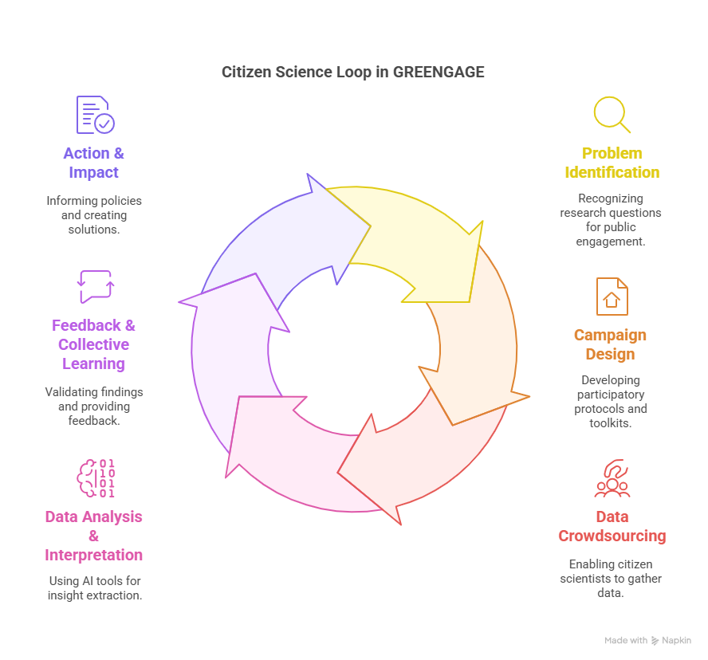
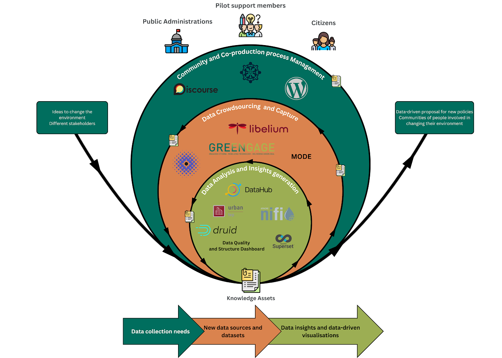
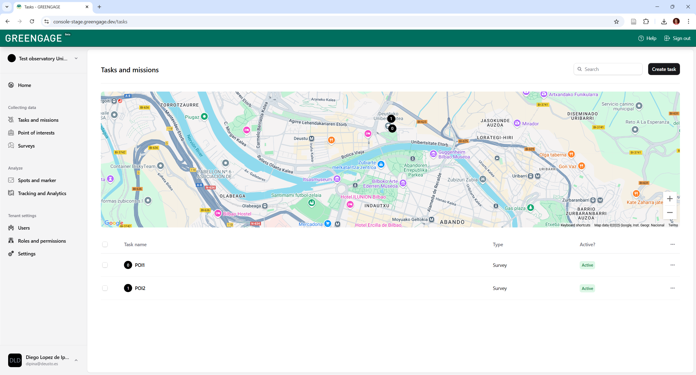
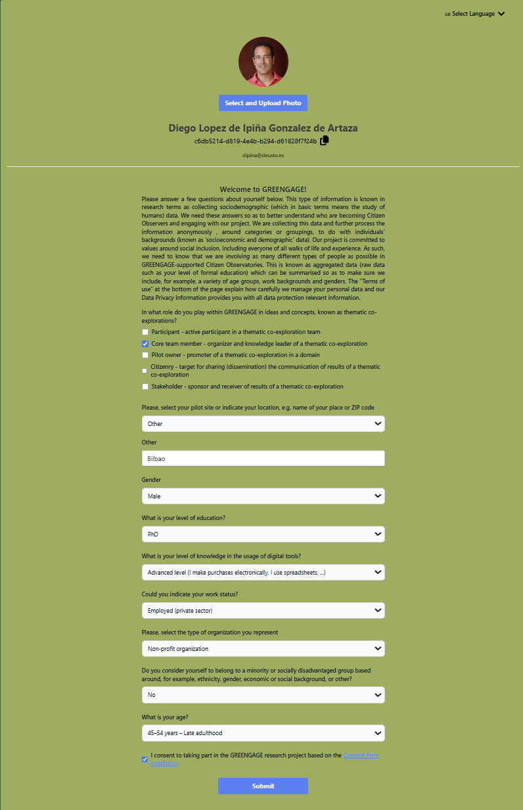

# Completion of a Citizen Science Loop with GREENGAGE

## Citizen Science loop in thematic co-explorations within Citizen Observatories

Citizen Observatories (COs) empower individuals to actively participate in data collection and environmental monitoring to address local challenges. The GREENGAGE project, under the Horizon Europe framework, aims to enhance the efficacy and more widespread adoption of COs by providing a structured Citizen Science Loop methodology operationalized by a co-production process which is enabled by its GREEN Engine infrastructure. One core contribution brought forward by GREENGAGE is the “thematic co-exploration” concept. A thematic co-exploration, in the context of COs, refers to a collaborative approach where citizens actively participate alongside scientists and other stakeholders in exploring specific themes or topics related to environmental monitoring and observation. Through them, COs are made purposeful by leveraging the collective efforts of individuals, often non-scientists, to gather, share, and analyse environmental data, typically facilitated by digital tools and technologies. 

This documentation describes the validation of the GREENGAGE co-creation process for thematic co-explorations, through a university campus based thematic co-exploration, which results in the execution of the following 6 steps of a Citizen Science loop, namely: 
1. Problem identification – recognizing research questions or societal challenges suitable for public engagement; 
2. Campaign design – developing participatory protocols, data collection methodologies, and toolkits for citizens’ engagement; 
3. Data crowdsourcing – enabling citizen scientists to gather good quality observations via digital applications, sensors, and surveys, through data crowdsourcing activities; 
4. Data analysis & interpretation – employing AI-driven tools for insight extraction and thus making humanly meaningful the data modelled; 
5. Feedback & collective learning – validating findings with humans and providing participants with actionable feedback; and 
6. Action & impact - informing policies, creating solutions, and refining methodologies for future CS campaigns exploring similar or complementary thematic co-explorations.

 

## GREENGAGE platform to enable Citizen Observatories

These CS loop stages shown above are aligned to the main phases established by GREENGAGE’s co-creation process for thematic co-explorations, which has been devised to organize, execute and exploit the results of CS campaigns. These main phases which compose the GREENGAGE co-creation process, supported by the Collaborative Environment (fully described at [HOWTO Thematic co-exploration](https://greengage-project.github.io/Documentation/HOWTO%20Thematic%20co-explorations/) documentation page, are:
- Phase 1 - preparing: fully aligned with the “problem identification” stage of a Citizen Science loop, comprises the following aspects: a) theme selection; b) pilot owners training; c) core team onboarding and d) core team training.
- Phase 2 – designing: aligned with the “campaign design” stage of a CS loop, comprising: a) experiment specification; b) tools’ resources selection; c) tools resources customization and d) tools resources testing.  
- Phase 3 – experimenting: aligned with both the “data crowdsourcing” and “data analysis & interpretation” steps of a CS loop. It comprises the following activities: observers onboarding, observers training support, data collection, data combination, data analysis, data visualization and evaluation.
- Phase 4 – sharing: aligned with “feedback & learning” and “action & impact” stages of CS loop, comprising the following tasks defined in the GREENGAGE thematic co-exploration process, namely storytelling, policy advocacy and sustainability.
 
Each phase is supported by GREENGAGE’s GREEN Engine infrastructure, named GREEN Engine, fully described at page [Citizen Observer journey](https://greengage-project.github.io/Documentation/thematic_coexploration_example/#citizen-observer-journey), which integrates various digital tools and knowledge assets to streamline the co-production process. The tools and knowledge assets created in GREENGAGE are categorized in the following areas of concern, where the names of the tools defined for each layer is indicated:
1.	Community and Co-production Process Management: In it, the emphasis is on building a strong, informed, and active community which collaborates through a co-production process by defining a hypothesis, research questions formulation or datasets selection, among others.
2.	Data Crowdsourcing and Capture: Based on the groundwork of the previous area of concern, this materialises into concrete data collection activities. It is characterized by active participation, leveraging technology to gather vital curated high quality environmental data.
3.	Data Analysis and Insights Generation: In this latter area of concern, the collected data is transformed into actionable insights. This is where the data, once transformed in actionable information, becomes a powerful tool for understanding and influencing environmental policy.

The purpose of this documentation is to exemplify how the CS loop is enabled through the suite of tools and knowledge assets defined by GREENGAGE and shown in the below figure. Thus, next section describes how GREENGAGE validates the Citizen Science Loop through a real-world thematic co-exploration at the University of Deusto. 

1. **Community and Co-production Process Management:** Throughout this phase, the emphasis is on building a strong, informed, and active community which collaborates through a co-production process.
2. **Data Crowdsourcing and Capture:** Based on the groundwork of the previous phase, e.g. definition of hypothesis, research questions formulation or datasets selection, among others, this phase materialises into concrete data collection activities. It is characterized by active participation, leveraging technology to gather vital environmental data.
3. **Data Analysis and Insights Generation:** In this phase the collected data is transformed into actionable insights. This phase is where the data, once transformed in actionable information, becomes a powerful tool for understanding and influencing environmental policy. 

 

## Citizen Science loop step-wised co-creation

This section showcases the process, tools and results obtained when applying the GREENGAGE CO-enabling approach to a real use-case, namely, “reflection on the suitability and air quality of important points of interest (POIs) within the campus of the University of Deusto in Bilbao, Spain”. The following subsections describe the different steps completed towards fulfilling the CS loop for this thematic co-exploration. Notice that to coordinate the execution of this co-creation process, a new process was defined in the Collaborative Environment as shown in Fig. 2.

### A.	CS campaign specification 

First thing in the organization of a thematic co-exploration, within a Citizen Observatory, is to decide what is the socio-economic and/or environmental challenge that wants to be addressed. There are different aspects that need to be decided at this stage. A useful knowledge asset or CO enabler, as they are called in GREENGAGE, is the thematic [co-exploration specification template which is a Word template](https://demo.greengage-project.eu/dashboard/interlinkers/bdc5daeb-c36a-45d7-85c6-6e27a73ae341) which guides the organizers of a thematic co-exploration through the following questions: 
1. WHY – reason why this Citizen Observatory’ thematic co-exploration is needed; 
2. WHO – stakeholders involved and affected who need to be recruited for the co-exploration to take place and for the outcomes to be disseminated to; 
3. WHAT – actual endeavours/activities of the Citizen Observatory’s thematic co-exploration towards validating a defined hypothesis and populate a given set of metrics; 
4. WHEN – planning of activities (resources&time) when undertaking the Citizen Observatory’s thematic co-exploration, e.g. crowd-sourcing and data analysis sessions needed; 
5. WHERE – geographical area where Citizen Observatory’s thematic co-exploration will take place, i.e. area to cover and specific points and frequency of measurements which are needed to ensure valuable crowdsourced data; 
6. WHICH – materials and resources, i.e. actual materials, devices and tools needed to execute the Citizen Observatory’s thematic co-exploration, coming either from GREENGAGE or other publicly available tools and assets; 
7. HOW – specification of data analysis processes/workflows to be able to capture, analyse and generate indicators and visualizations sought in Citizen Observatory’s thematic co-exploration. In this stage the needed visualizations and possible storytelling approaches to be eventually adopted are co-specified too. 

As result, a [thematic co-exploration specification for University of Deusto's campus](https://github.com/Greengage-project/Documentation/blob/main/docs/assets/ThematicCoExplorationSpec%20-%20UnivDeusto.pdf) has been produced, where the following decisions were taken:
-	Set up the observers’ team, in this case 10 researchers associated to the MORElab research group were recruited and committed to be engaged in the whole co-creation process.  
-	Definition of different places (POIs) at the University’s campus (4 were selected) where to gather air quality and place suitability perceptions. These POIs are in the surroundings of the Faculty of Engineering’s building at University of Deusto.
-	Definition of metrics to estimate air quality and campus space suitability. For that, two new metrics were co-defined by the team of observers in a meeting, namely, a *Perception of Air Quality Index (PAQI)* was made up, where on a scale from 1 to 5, people have to indicate their perception from very clean (no noticeable pollution effects) to highly polluted (major health concerns, unlivable conditions), and, the *Public Space Suitability Index (PSSI)* was also made up, where again in a 1 to 5 scale, volunteers have to express their perception regarding aaccessibility & connectivity (20%), safety & security (15%), environmental quality (15%), functionality & comfort (20%), sociability & inclusivity (15%) or maintenance & management (15%) aspects. Again, 5 ranges of suitability were defined ranging from excellent suitability (average answer values >4) to poor suitability (<1). Apart from perceptions of air quality, those volunteers who counted with an [Atmotube Pro device](https://atmotube.com/atmotube-pro) also collected air quality data through it. 
-	Definition of tasks to be performed at each selected POI. Firstly, gather a visual perception (photo) and secondly, complete a short 3 question survey for volunteers to express their perception about place suitability and air quality, plus having the chance to leave some feedback about the visited POI. Notice that for the sake of simplicity, one single question per metric was provided to feed the above-mentioned metrics. In a more extensive and thorough real-world thematic co-exploration, one question for each of the factors feeding the devised PSSI should have been included, for instance. Next, the questions designed for the questionnaires to be completed by volunteers at each of the selected POIs are listed:
   1.	Do you consider that the Air Quality in this spot is? a) very bad; b) bad; c) normal; d) good; e) very good
   2.	Do you consider that this POI is suited to facilitate campus life and activities? a) not at all; b) not significantly; c) it is OK; d) good enough; e) very good
   3.	Provide feedback about this POI in terms of its suitability and/or air quality perception. Any suggestions, improvements that you would add?

### B.	Design of the crowdsourcing campaign

Once the specification of the thematic co-exploration is ready, the next critical stage is to co-design the CS crowdsourcing campaign – based on the hypothesis, objectives and data gaps previously identified in [thematic co-exploration specification for University of Deusto's campus](https://github.com/Greengage-project/Documentation/blob/main/docs/assets/ThematicCoExplorationSpec%20-%20UnivDeusto.pdf). In GREENGAGE, the following parameters must be completed in order to set up a CS crowdsourcing campaign: 
1. A new instance of an observatory entity is defined, specifying a name for it and the geographical area it covers;
2. A set of POIs within the defined area are defined, for each POI the following fields are defined: type (e.g. culture, nature and so on), description, latitude & longitude, and optional photo; 
3. In each POI several tasks can be defined, usually in a campaign the same tasks are required at every measurement point, for each task the following fields are defined: POI associated, topic (e.g. air quality, safety and so on), type (survey, photo, walk and so on), title, description and geocoordinates
4. For tasks of type survey, a survey has be created or an already existing one linked, providing the following fields: title and a set of questions, where for each question a title, type (single choice, multiple choice, text request), and options as pairs of id and values must be defined. The next figure exemplifies the crowdsourcing campaign defined for the thematic co-exploration at Deusto’s campus.  

 

Next, it is shown the dashboard that has been defined as back-end of the GREENGAGE app and which can be used to configure CS crowdsourcing campaigns in GREENGAGE. For more details on how to use this interface check [GREENGAGE back-end's crowdsourcing campaign configuration dashboard's documentation](https://docs-stage.greengage.dev/docs).

 

### C.	Collect, extract, transform and load campaign data

On Friday 14th March 2025, from 11:30am to 12:30pm CET, a crowdsourcing campaign was executed, where 10 people took part. Notice that volunteers before starting the crowdsourcing campaign they were requested to complete the following actions:

1. They had to log into [https://me.greengage-project.eu/](https://me.greengage-project.eu/) and complete there a sociodemographic form as the one shown in the figure below. Notice that this form requires that each participant specifies her role in the thematic co-exploration, gender, age range, work status, education level and so on. Besides and, very importantly, volunteers must accept a consent form at the bottomo of this page by means of which GREENGAGE is allowed to process their supplied data and aggregate with other participant's sociodemographic data, still preserving the privacy of participants at all time. Only, after they have completed this form, users are allowed to log in into the GREENGAGE app devised to capture data.

 

2. They had to complete a PRE Impact evaluation questionnaire
3. They had to download and install the GREENGAGE app either in their Android or Apple smartphones. Platform names give direct access to those willing to install the GREENGAGE app. Notice that the GREENGAGE app also allows users to register as done in step 1, if they do not have credentials, so that they can access into the app. 

After, these preparation activities, volunteers were ready to launch the GREENGAGE app, as shown below, and use it to collect data:

|----------------|----------------|----------------|
|  |  |  |

The crowdsourced campaign data was collected by applying an ETL process. Whilst, the PRE and POST impact and satisfaction questionnaires were hosted in Google Forms, the the GREENGAGE app’s collected data was hosted at Apollo Server which exhibits a GraphQL API. This API allows clients (such as mobile apps or web frontends) to efficiently query and interact with campaign data. This interface was used to retrieve all data crowdsourced associated to the POIs and spots generated in the thematic co-exploration’s crowdsourcing campaign. Fig. 6 shows the Apollo Server front-end where details in JSON about tasks performed in the crowdsourcing campaign are retrieved by means of a GraphQL query. Notice that GraphQL is a modern API query language and runtime that allows clients to request precisely the data they need in a single request, unlike RESTful APIs which rely on multiple endpoints and fixed data structures, often leading to over-fetching or under-fetching of data.
 
Fig. 6.	Front-end of Apollo Server where GraphQL queries are issued. 
The ETL process corresponding to the crowdsourcing campaign was implemented as a Python script utilizing asynchronous programming patterns to efficiently extract, transform, and load GREENGAGE app’s data. For data extraction, the script interfaces with GREENGAGE app’s GraphQL API endpoint to retrieve mission data, including various mission types (e.g. SURVEY, WALK or DATASET). Additional observatory-related data is collected to provide geographical context for each mission during transform stage of the process. Finally, the script also interfaces with a Keycloak-based [11] authentication service customized for GREENGAGE, which allows extracting participants’ socioeconomic user data. Such service enables anonymization while preserving demographic information. Fig. 7 illustrates the web form devised that was completed by the 10 volunteers of the campaign to have access to GREENGAGE resources. 
During transformation, mission data is processed according to type-specific rules. For example, a SURVEY type task, requires additional API calls to retrieve associated quantitative survey values, or GEOTRACKING type mission requires additional API call to retrieve associated GeoJSON object. The transformation phase maps tasks to observatory information, enriches records with anonymized user demographic data, and converts all data to a standardized CSV format with appropriate fields for analysis. This step is crucial because Apache Druid [12], the real-time analytics database used in the loading phase, requires data to be ingested in a structured format. Druid stores data internally in a columnar format, which optimizes it for fast aggregations and queries.
Finally, the load phase utilizes Apache Druid's ingestion API [13] to load the transformed data. The script generates a comprehensive ingestion specification defining data types, dimensions, and granularity settings to optimize subsequent analytical queries. Once ingested, the data becomes immediately queryable through Druid's SQL API, which enables seamless integration with visualization platforms like Apache Superset and other analytics tools.
Notice that 3 ETL processes were set up to extract, transform and load data from: 1) photos gathered through task 2 (see Fig. 4); 2) survey answers associated to the different users and POIs where surveys were responded through task 1 (see Fig. 4); and c) socio demographic data completed by volunteers when they signed up to take part in the observatory, by means of the https://me.greengage-project.eu page shown at Fig. 7. As result of these ETL processes, data was stored in Apache Druid infrastructure (see Fig. 8), which is the storage solution chosen within GREEN Engine. 
 
Fig. 7.	Sociodemographic profile of campaign participants.
As result of such campaign the following number of measurements were gathered:
•	10 people completed a sociodemographic questionnaire which granted them access GREENGAGE app, after a consent form was signed.
•	10 people also completed the PRE Impact evaluation questionnaire, as part of the ex-ante and ex-post evaluation approach [14] adopted by the project. 
•	10 people completed an alpha testing questionnaire to provide feedback about the GREENGAGE app, and thus enhance its eventual acceptance.  
•	10 people completed the POST Impact evaluation questionnaire
•	21 photos were gathered at spots defined near the 4 POIs visited by the 10 volunteers, where potential issues were identified.
•	90 answers to the 3-question survey associated to each of the 4 POIs defined in the campaign were gathered. 
•	180 air quality measurements were gathered by the 4 Atmotube devices carried by volunteers (39 PM2.5 measurements). 
 
Fig. 8.	Crowdsourcing campaign’s survey data loaded into Druid.
 
Fig. 9.	Geolocated survey’s analysis for one single POI.
 
Fig. 10.	Geolocated survey’s analysis for one question in all POIs.

