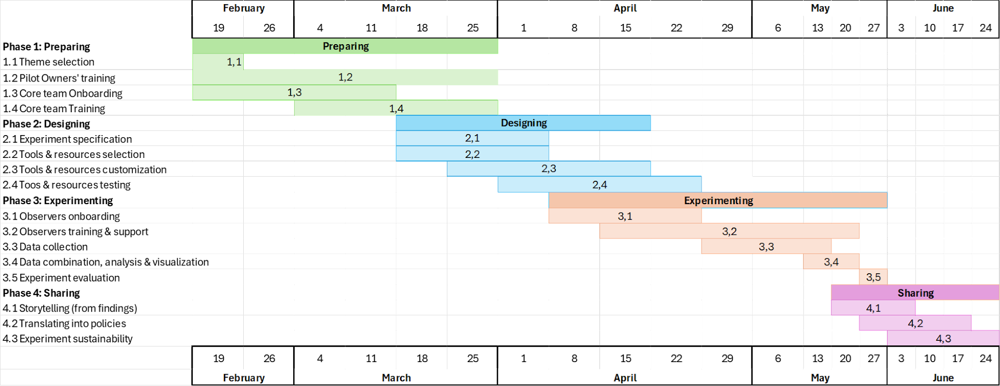

# HOWTO Thematic co-exploration 
This document describes the collaborative process, i.e. set of steps that should be carried out in a logical sequence to co-deliver a thematic co-exploration. Notice that co-production, alternatively known as co-creation, consists of two phases [CO-DESIGN and CO-DELIVERY](https://demo.interlink-project.eu/coprod).   

Importantly, these steps are indicative and there could be different journeys through them, i.e. some may be skipped, and some new steps added if the co-producers of a thematic co-exploration so consider.  

Besides, a thematic co-exploration is a collaborative and iterative process, i.e. several iterations over some of the steps of the collaborative process may be needed.  

There are four main phases that the thematic co-exploration might cover. Probably you already performed some of these phases, or at least some steps of those phases, of this workplan, you can take advantage on that and go for the next one.  

 

 

- [**Phase 1: Preparing**](#phase1) 
    - [1.1 Theme Selection](#task1.1) 
    - [1.2 Internal (Pilot Owner) training & preparing](#task1.2)  
    - [1.3 Core Team Onboarding](#task1.3) 
    - [1.4 Training of the core team](#task1.4) 
- [**Phase 2: Designing**](#phase2) 
    - [2.1 Experiment specification](#task2.1)  
    - [2.2 Tools and resources selection](#task2.2) 
    - [2.3 Tools and resources customization](#task2.3) 
    - [2.4 Testing tools and resources](#task2.4) 
- [**Phase 3: Delivering**](#phase3) 
    - [3.1 Observers onboarding](#task3.1) 
    - [3.2 Training and support](#task3.2) 
    - [3.3 Data collection](#task3.3) 
    - [3.4 Data combination, analysis & visualization](#task3.4) 
    - [3.5 Experiment evaluation](#task3.5) 
- [**Phase 4: Sharing**](#phase4) 
    - [4.1 Storytelling (from findings)](#task4.1) 
    - [4.2 Translating into policies & assess impact](#task4.2) 
    - [4.3 Experiment sustainability](#task4.3) 
 

# Phase 1: Preparing  

 

## 1.1. Theme Selection  

### Responsible 
Pilot owner and PST members.  

### Objective 
The primary objective of this step is to formulate precise research questions and hypotheses that are anchored in the needs and priorities of policy-making for a given area where thematic co-exploration could be advisable. Guided by pilot owners who are part of the PST team and know well what are the priorities of a given Citizen Observatory, an area of interest to research through a thematic co-exploration is chosen. It might be necessary to get additional stakeholders on board who e.g. are relevant as they provide specific local knowledge or they should have a meaningful role in the innovation of governance processes.  

The devised research questions and hypotheses should be actionable, measurable, and capable of being empirically tested within the thematic co-exploration’s scope. They should be designed to fill knowledge gaps, address current challenges, and generate evidence to translate into effective policy interventions.   

This step will involve a thorough analysis of the current policy landscape, consultation with stakeholders of the GREENGAGE Observatory, and a review of the existing literature to ensure that the research is targeted and relevant. This foundational step sets the stage for the subsequent research and data collection efforts, ensuring that the thematic co-exploration’s outcomes align with the strategic goals of influencing and enabling policy-making.  

### How can we achieve it? 
After having chosen an area of high priority to tackle a thematic co-exploration, guided by the [Thematic Co-Exploration for Citizen Observatory (COb) Specification](https://aitonline.sharepoint.com/:w:/r/sites/HEUGREENGAGE337/_layouts/15/Doc.aspx?sourcedoc=%7BB2395027-626C-44CC-98DC-124E9DC5750B%7D&file=ThematicCoExplorationSpec.docx&action=default&mobileredirect=true) document, a group of GREENGAGE Observers (GObs), citizens, civil servants and other stakeholders, who will govern / organise the pilot and moderate the thematic co-exploration, answer, in collaboration with owners of the Citizen Observatory,  the following core questions:  

 
 - WHY – Reason why this Citizen Observatory’ thematic co-exploration is needed (arguments for promoting the execution of this Citizen Observatory’s campaign)  

 - WHO – different and affected stakeholders’ groups in Citizen Observatory’s thematic co-exploration (describe the target groups and their possible motivation)  

 - WHAT – Actual endeavours of the Citizen Observatory’s thematic co-exploration (describe what will exactly be done in this Citizen Observatory)  

 - WHEN – Planning of activities and period when Citizen Observatory’s thematic co-exploration will be executed (indicate for how long, what activities, where and for whom will be realized)  

 - WHERE – Geographical locations where Citizen Observatory’s thematic co-exploration will take place (actual geographical areas where data collection and analysis will be carried out)  

 - WHICH – Materials and resources (actual materials and resources needed to execute the Citizen Observatory’s thematic co-exploration)  

 - HOW – Data analysis process to be able to capture, analyse and generate indicators and visualizations sought in Citizen Observatory’s thematic co-exploration  

 

The [Thematic Co-Exploration for Citizen Observatory (COb) Specification](https://aitonline.sharepoint.com/:w:/r/sites/HEUGREENGAGE337/_layouts/15/Doc.aspx?sourcedoc=%7BB2395027-626C-44CC-98DC-124E9DC5750B%7D&file=ThematicCoExplorationSpec.docx&action=default&mobileredirect=true) document does not need to be completed thoroughly in this step. It is paramount that the first questions of this document are filled in. It is the WHAT question the one that actually addresses the following aspects essential to start with the co-production of a thematic co-exploration:  

 

 - The problem (describe the problem statement and the challenge that you are addressing)  

 - Objectives (describe the intended result)  

 - Added value (describe the potential benefits for the Citizen Observatory’s thematic co-exploration’s stakeholders)  

 - Current and desired situation (describe the current approach including existing practices, and the desired situation)  

 - CS hypothesis and research questions (to be validated by the outcomes of the execution of the Citizen Observatory’s thematic co-exploration)  

 - Metrics definition (of indicators of success for the Citizen Observatory’s thematic co-exploration)  

 

Notice that some additional optional resources are listed below which could be used before filling in the thematic co-exploration’s specification, to help narrowing the problem and reflecting about the suitability of the problem to be addressed through a thematic co-exploration.   

 

### Resources 

 - [Citizen Science problem statement analysis](https://aitonline.sharepoint.com/:x:/r/sites/HEUGREENGAGE337/Shared%20Documents/WP4%20CO%20enabling%20infrastructure%20and%20interoperable/D4.1%20GREEN%20Engine%20and%20manuals/Academy/resources/Citizen%20Science%20ProblemStatementQuestionnaire.xlsx?d=w2a0a58548f2f41a8821b4ed300a86be2&csf=1&web=1&e=TLG1AL) – this resource allows to perform a minimal viability analysis to determine whether a problem that wants to be tackled is approachable through Citizen Science or not.   

 - [Questionnaire to analysise suitability of the problem for co-production of CS experiment](https://aitonline.sharepoint.com/:x:/r/sites/HEUGREENGAGE337/Shared%20Documents/WP4%20CO%20enabling%20infrastructure%20and%20interoperable/D4.1%20GREEN%20Engine%20and%20manuals/Academy/resources/CoProductionCSProjectQuestionnaire.xlsx?d=wb8a26c5d29d74f079642f04f2c0373c5&csf=1&web=1&e=DJh4qV) - this second resource can help you dilucidate whether a collaborative process can be organized or not, to address a given problem, through a Citizen Science experiment.  

 - [Thematic Co-Exploration for GREENGAGE Observatory (GO) Specification Template](https://aitonline.sharepoint.com/:w:/r/sites/HEUGREENGAGE337/Shared%20Documents/WP4%20CO%20enabling%20infrastructure%20and%20interoperable/D4.1%20GREEN%20Engine%20and%20manuals/Academy/resources/ThematicCoExplorationSpec.docx?d=wb2395027626c44cc98dc124e9dc5750b&csf=1&web=1&e=uT1gDq) – this resource is the most important one in this stage since it allows to answer the WHY, WHO, WHAT, WHEN, WHERE, with WHICH and HOW questions associated to the organization and planning of a thematic co-exploration. It is designed to compile all the information needed to get started with a thematic co-exploration. It gets information from the CONCEPTUALISING and PREPARING phases of the GREENGAGE methodology for Citizen Observatories.   

 

 

## 1.2. Internal (Pilot Owner) training & preparing  

 

### Responsible 

Pilot owners with the support of the PST. 

 

### Objective 

The objectives of this task is to empower pilot owners with a deep understanding of the capabilities and resources provided by the GREEN Engine, facilitating the strategic planning and execution of thematic co-explorations. A key goal is to compile a comprehensive and organized inventory of datasets relevant to the thematic area of exploration. This inventory will not only catalog existing datasets but also identify critical data gaps that cannot be filled by existing resources. Addressing these gaps is crucial for the thorough examination of the thematic area and for generating actionable insights. To fill these gaps, the strategy includes mobilizing citizen participation in data gathering campaigns. By leveraging the collective effort and unique perspectives of citizens, the initiative aims to enrich the dataset inventory with valuable, real-world data. 

 

### How can we achieve it? 

To optimize the integration of technology in thematic co-explorations, pilot owners will first identify relevant technologies offered by the GREEN Engine that align with their exploration objectives. Subsequently, tailored practical training sessions will be conducted for each selected technology, ensuring pilot owners are equipped with the necessary operational skills and knowledge. These sessions are designed to be hands-on, focusing on the functionalities, data management, and application of technologies pertinent to their specific needs. This approach ensures efficient learning and preparation, enabling pilot owners to effectively leverage these technologies to enhance data collection, analysis, and the overall success of their thematic explorations, thereby contributing to impactful insights and policy-making. 

 

Furthermore, PST members  should comprehensively identify all existing and potential datasets within the scope of the Citizen Observatory and, particularly, those needed for the thematic co-exploration considered. This step aims to create an inventory of datasets, categorising them based on the current thematic co-exporation’s ID, relevance, data type, source, and intended use. Furthermore, it is essential to specify how each dataset may be retrieved and accessed. This inventory serves as the foundation for the dataset metadata registration process in DataHub. Population of Dataset with the newly created inventory is the final action within this step.  

 

### Resources 

 - [Dataset Inventory template](https://aitonline.sharepoint.com/:x:/r/sites/HEUGREENGAGE337/_layouts/15/Doc.aspx?sourcedoc=%7B632ec461-1851-463e-87de-01eedb9d2263%7D&action=edit&wdinitialsession=c2406669-913f-4a32-b5b5-3334b3429bd4&wdrldsc=2&wdrldc=1&wdrldr=OnSaveAsWebMethodComplete) – knowledge asset with fields  to identify every dataset’s metadata that will be needed for the thematic co-explorations in each Citizen Observatory. It is recommended that for each thematic co-exploration a a copy of this template is performed and filled in.  

 

 - [DataHub](https://greengage-project.github.io/Documentation/tools/datahub/) – HOWTO for tool used to register, search and view metadata about what datasets of a given thematic area are already available in the catalogue of such Citizen Observatory. The dataset inventory template completed for a given thematic co-exploration should be used as input to complete the datasets metadata in DataHub.  

 

 - [GREENGAGE documentation](https://greengage-project.github.io/Documentation/) – Overall documentation of the tools that are available in the GREEN Engine. 

 

 - [Training materials](TBD) -- TBD 

 

 

## 1.3. Core Team Onboarding  

 

### Responsible 

Pilot leader with the support of the PST. 

 

### Objective 

To build a solid foundation for thematic co-explorations, the first objective involves creating a comprehensive map of potential stakeholders who could contribute significantly to the Core Team or join the ranks of the GREENGAGE Observers. This mapping will identify key individuals and organizations whose expertise, interests, and resources align with the goals of the exploration, ensuring a diverse and skilled team that can address the project's multifaceted challenges. Following this strategic identification, the second objective focuses on the onboarding of approximately 15 individuals who will play a crucial role in Phase 2 of the exploration. This group will be meticulously selected based on their potential to contribute to the project's success, ensuring they possess the necessary skills, knowledge, and enthusiasm. The onboarding process will equip them with a thorough understanding of the project objectives, methodologies, and expected outcomes, preparing them to effectively contribute to the collaborative efforts required for the exploration's success. Together, these objectives aim to establish a strong, collaborative team capable of driving the project forward through its critical early phases. 

 

### How can we achieve it? 

To achieve the objectives, the PST will work closely with the pilot leader to identify and engage potential stakeholders who could contribute to the thematic co-exploration. This will involve the strategic mapping of stakeholders, identifying their roles, interests, and potential contributions to the project by filling the [Stakeholder Mapping Canvas](https://demo.greengage-project.eu/dashboard/interlinkers/a976a58e-60c7-40c4-9af3-ceec2db08277).  

 

Following this to facilitate discussions and community engagement, Discourse will be integrated, providing a modern and user-friendly forum for exchange and collaboration. In parallel, WordPress will serve as our content management system, offering a versatile platform for information dissemination and interaction with the broader community. Through these platforms, the way in which the interested stakeholders can join and contribute to the thematic co-exploration will be communicated (following all the GDPR and ethical guidelines).  

 

Finally, a first workshop will be organized to onboard the Core Team, specifically designed for the Core Team, aimed at providing a comprehensive overview of the pilot's objectives, the governance model, and presenting a preliminary draft of the forthcoming steps. This session serves as a crucial platform for aligning the team's understanding and expectations, fostering an environment of open communication and collaboration from the outset. It is an opportunity not only to introduce team members to the broader vision and operational framework of the pilot but also to engage in a dialogue that encourages feedback, suggestions, and collective brainstorming. 

 

### Resources 

 - [Stakeholder Mapping Canvas](https://demo.greengage-project.eu/dashboard/interlinkers/a976a58e-60c7-40c4-9af3-ceec2db08277) – document to help you understand who are the stakeholders of your thematic co-exploration  

 - [WordPress](https://greengage-project.github.io/Documentation/tools/wordpress/) – HOWTO for tool essential to communicate the existence of a thematic co-exploration and allow dissemination of its results to the broader community  

 - [Discourse](https://greengage-project.github.io/Documentation/tools/Discourse/) –  HOWTO for tool necessary to foster discussions and dialogue among GObs and allow them to request help and support each other   

 - [Collaborative Environment](https://greengage-project.github.io/Documentation/tools/collaborativeEnvironment/) – HOWTO for essential tool to govern, guide and trace the co-production process executed during the co-design and co-delivery of the thematic co-exploration  

 - Communication map (UnaLab and Scivil, to be adapted)  

 - Inclusion check list (to be adapted)  

 

## 1.4. Training of the core team  

 

### Responsible 

Pilot leader with the support of the PST. 

 

### Objective 

The objective of this task is to provide the Core Team with a comprehensive and deep understanding of the thematic co-exploration area. This involves a detailed briefing and training session that encompasses several key components essential for its successful execution. Firstly, the Core Team will be extensively familiarized with the specific thematic area of exploration, including its significance, objectives, and the specific challenges or questions it aims to address. This foundational knowledge is crucial for aligning the team's efforts and ensuring a cohesive approach throughout the exploration process.

In addition to understanding the thematic area, the Core Team will receive training on the ethical framework of GREENGAGE. This includes discussions on data privacy, ethical considerations in citizen science, and how to ensure that all activities conducted within the thematic co-exploration adhere to these ethical guidelines. 

Finally, the training will cover the technological tools available within the GREENGAGE ecosystem. The Core Team will learn how to utilize these technologies effectively, from data collection and analysis tools to platforms for collaboration and dissemination of findings. This technical training is essential for maximizing the impact of the thematic co-exploration, enabling the team to gather, analyze, and share data efficiently.

### How can we achieve it? 

Training materials for the following topics have been made ready by the project and should be extended and customized for each thematic co-exploration: 

 

 * [Data I](https://aitonline.sharepoint.com/:f:/r/sites/HEUGREENGAGE337/Shared%20Documents/WP3%20GREENGAGE%20Citizen%20Observatory%20Academy/06_Tasks/3.2%20Training%20%26%20recruitment%20material/Final%20Training%20Material/02_Data%20I?csf=1&web=1&e=BvDK7y) 
 * [Data II](https://aitonline.sharepoint.com/:f:/r/sites/HEUGREENGAGE337/Shared%20Documents/WP3%20GREENGAGE%20Citizen%20Observatory%20Academy/06_Tasks/3.2%20Training%20%26%20recruitment%20material/Final%20Training%20Material/03_Data%20II?csf=1&web=1&e=R7CbHg)
 * [Co-design I](https://aitonline.sharepoint.com/:f:/r/sites/HEUGREENGAGE337/Shared%20Documents/WP3%20GREENGAGE%20Citizen%20Observatory%20Academy/06_Tasks/3.2%20Training%20%26%20recruitment%20material/Final%20Training%20Material/04_Co-Design%20I?csf=1&web=1&e=n3pKVF)
 * [Co-design II](https://aitonline.sharepoint.com/:f:/r/sites/HEUGREENGAGE337/Shared%20Documents/WP3%20GREENGAGE%20Citizen%20Observatory%20Academy/06_Tasks/3.2%20Training%20%26%20recruitment%20material/Final%20Training%20Material/05_Co-Design%20II?csf=1&web=1&e=QuLd0O)
 * [Co-design III](https://aitonline.sharepoint.com/:f:/r/sites/HEUGREENGAGE337/Shared%20Documents/WP3%20GREENGAGE%20Citizen%20Observatory%20Academy/06_Tasks/3.2%20Training%20%26%20recruitment%20material/Final%20Training%20Material/06_Co-Design%20III?csf=1&web=1&e=CRUASy)
 * [Air quality & Mobility Monitoring]
 * [Technology I](https://aitonline.sharepoint.com/:f:/r/sites/HEUGREENGAGE337/Shared%20Documents/WP3%20GREENGAGE%20Citizen%20Observatory%20Academy/06_Tasks/3.2%20Training%20%26%20recruitment%20material/Final%20Training%20Material/07_Technology%20I?csf=1&web=1&e=0LYVat)
 * [Technology II]
 * [Technology III]
 * [Policy-making & Governance]
 * [Analysis & Visualisation]

 

 - Create a training plan specific for the pilot.  

 - Create the needed training material.  

 - Perform at least two training sessions – 1 hour each – to the Core Team. Make them as practical and applied as possible.  

 

### Resources 

 - Training plan template (to be done)  

 - [Materials for thematic co-exploration and citizen onboarding](https://www.greengage-project.eu/knowledge-base/) – TO BE PREPARED 

 - [Folder where trainings are currently uploaded](https://aitonline.sharepoint.com/:f:/r/sites/HEUGREENGAGE337/Shared%20Documents/WP3%20GREENGAGE%20Citizen%20Observatory%20Academy/06_Tasks/3.2%20Training%20%26%20recruitment%20material/Final%20Training%20Material?csf=1&web=1&e=OU8jg9) which will be published as part of the [Knowledge Base aka GREENGAGE Academy](https://www.greengage-project.eu/knowledge-base/) of the main project’s website 

 

# Phase 2: Designing  

## 2.1. Experiment specification  

 

### Responsible 

Pilot Leader with the support of the Core Team and the PST  

 

### Objective 

To successfully navigate through the latter stages of the thematic co-exploration, specifically phases 3 (Delivering) and 4 (Sharing), a meticulously crafted list of activities is essential. This list will outline the strategic actions required to not only implement the findings and insights gleaned from the exploration but also to disseminate these outcomes effectively to a broader audience. This comprehensive list of activities will serve as a roadmap, guiding the seamless transition from theory to practice and ensuring that the valuable insights generated through the exploration are shared widely and effectively, fostering greater impact and facilitating informed decision-making. 

 

### How can we achieve it? 

Organise a second workshop conducted with the Core Team. This workshop aims to collaboratively design the specific actions, including the identification of indicators or Key Performance Indicators (KPIs), that will be executed in phases 3 (Delivering) and 4 (Sharing) of the thematic co-exploration. By engaging in a co-design process, the Core Team will collectively determine the most effective strategies and activities to ensure the successful delivery and dissemination of the project's outcomes.  

 

Furthermore, a new co-production process will be set up in GREENGAGE Collaborative Environment. Hence, the accomplishment of this step requires usage of all the tools belonging to the “Community and co-production process management” layer of GREEN Engine. 

  

 - A new entry should be created within the parent pilot / Citizen Observatory page, for the newly specified thematic co-exploration. The [instructions to use Wordpress](https://greengage-project.github.io/Documentation/tools/wordpress/) should be followed to achieve this.  

 

 - A new set of categories for topics of discussion following the instructions of usage of the [Discourse tool](https://greengage-project.github.io/Documentation/tools/Discourse/), should be created by the GObs leading and managing the thematic co-exploration. This will serve to foster the collaboration and dialogue among participants in the thematic co-exploration .  

 

 - A new co-production process based on the “GREENGAGE way” co-production process schema or blueprint already loaded into [Collaborative Environment](https://greengage-project.github.io/Documentation/tools/collaborativeEnvironment/) should be instantiated.   

 

 

### Resources 

 - Work plan template (to be adapted)  

 - Data management plan (to be done)  

 - Data protocol specification (to be done)  

 - [Collaborative Environment](https://greengage-project.github.io/Documentation/tools/collaborativeEnvironment/) – HOWTO for essential tool to govern, guide and trace the co-production process executed during the co-design and co-delivery of the thematic co-exploration 

 - [CS-CO-schema-process-specification](https://aitonline.sharepoint.com/:x:/r/sites/HEUGREENGAGE337/_layouts/15/Doc.aspx?sourcedoc=%7B3D2E1BC5-96E9-4C2F-AC70-DAD6DD88D83C%7D&file=CS-CO-schema-process-specification.xlsx&action=default&mobileredirect=true&DefaultItemOpen=1) –  to specify the process of the thematic co-exploration ala “GREENGAGE way” 

 - [Problem Statement Questionnaire](https://aitonline.sharepoint.com/:x:/r/sites/HEUGREENGAGE337/_layouts/15/Doc.aspx?sourcedoc=%7B2A0A5854-8F2F-41A8-821B-4ED300A86BE2%7D&file=ProblemStatementQuestionnaire.xlsx&action=default&mobileredirect=true) document –  

 

## 2.2. Tools and resources selection  

 

### Responsible 

Pilot Leader with the support of the Core Team and the PST. 

 

### Objective 

To achieve the set objectives of the thematic co-exploration efficiently, a meticulous selection process will be undertaken to finalize the list of tools and resources essential for the project. This encompasses a wide array of assets, including, but not limited to, existing datasets that are pivotal for research and analysis, comprehensive guidelines that outline procedural directives, and thorough documentation that provides detailed instructions and insights into the project's methodologies. Additionally, other instrumental resources such as analytical software, data management platforms, and collaborative tools will be evaluated for their relevance, efficiency, and compatibility with the project goals. This careful curation process ensures that every selected tool and resource aligns with the specific needs of the exploration, facilitating a streamlined, effective approach to achieving the research objectives.  

 

### How can we achieve it? 

To achieve this objective we will conduct a third workshop with the Core Team. This workshop will focus on the selection of the tools and resources that will be used in the thematic co-exploration. The Core Team will collaboratively evaluate and select the most appropriate tools and resources, ensuring that they align with the project's objectives and are capable of meeting the specific needs of the experiment specificed in T2.1. This analysis may rise the identification of gaps in the available tools and resources, which will be addressed in the T2.3. 

 

### Resources 

 - List of resources 

 - [List of tools](https://greengage-project.github.io/Documentation/tools/) – Overall documentation of the tools that are available in the GREEN Engine. 

 

## 2.3. Tools and resources customization  

 

### Responsible 

Pilot Owner with the support of PST and WP4.  

 

### Objective 

To ensure the effectiveness and efficiency of the thematic co-exploration, it is necessary to undertake customizations on the tools utilized, including calibration, configuration, and possible extensions. This process is complemented by providing technical consultancy to address specific needs, thereby enhancing the functionality and usability of these tools for the observers. Concurrently, resources such as templates, documentation, and translations are optimized, along with the development of enablers, to streamline observers' activities and facilitate their engagement. Data quality is also a priority, with efforts directed towards cleaning available datasets to ensure reliability and accuracy in analysis. Additionally, ad-hoc development may be undertaken to meet unique project requirements. Preparing evaluation materials forms a critical component of this phase, encompassing the creation of questionnaires, refinement of Key Performance Indicators (KPIs), and the selection or development of measurement instruments, all aimed at rigorously assessing the impact and outcomes of the co-exploration activities. 

 

### How can we achieve it? 

The Pilot Owner and PST will agree on a plan with WP4.  

 

### Resources 

TBD 

 

## 2.4. Testing tools and resources  

 

### Responsible 

Pilot Leader with the support of the Core Team and the PST. 

 

### Objective 

The objective of this task is to perform a last test on the selected and adapted tools and resources. This task is essential to validate the functionality, compatibility, and performance of all tools and resources that have been selected to conduct the designed experiment. It involves rigorous testing scenarios that mimic real-world applications to identify any remaining issues or inefficiencies that could impact the project's success. This process not only encompasses technical tools such as data analysis software and data collection applications but also includes testing the usability and clarity of guidelines, documentation, and any other support materials. The objective is to guarantee that every component functions seamlessly together, providing a robust framework for observers and participants to engage effectively in the project activities.  

 

### How can we achieve it? 

The Core Team will have a workshop in which the selected tools and resources will be tested in real life scenarios to ensure the functionality, compatibility, and performance of them. 

 

### Resources 

 - List of resources 

 - [List of tools](https://greengage-project.github.io/Documentation/tools/) – Overall documentation of the tools that are available in the GREEN Engine. 

 - Evaluation questionnaires (to be done) 

 

# Phase 3: Delivering   

## 3.1. Observers onboarding  

 

### Responsible 

Pilot Owner with the support of the Core Team and the PST. 

 

### Objective 

This task focuses primarily on integrating these key participants into the project's operational phase without delving into training and support, which are addressed in subsequent steps. This phase is about ensuring that GOs are well-informed about their roles, the project's objectives, and the overarching framework within which they will operate.  

 

### How can we achieve it? 

Similar to what we conducted in [T1.3.](#task1.3), we will continue adapting and enhancing the communication campaign in the pilot. Together with this, we should update the Discourse and WordPress platforms to ensure that the information is up-to-date and accessible to the GOs.  

 

### Resources 

- [Stakeholder Mapping Canvas](https://demo.greengage-project.eu/dashboard/interlinkers/a976a58e-60c7-40c4-9af3-ceec2db08277) – document to help you understand who are the stakeholders of your thematic co-exploration 

- [Discourse](https://greengage-project.github.io/Documentation/tools/Discourse/) –  HOWTO for tool necessary to foster discussions and dialogue among GObs and allow them to request help and support each other 

- Communication map (UnaLab and Scivil, to be adapted)  

- [Materials for thematic co-exploration and citizen onboarding](https://www.greengage-project.eu/knowledge-base/) – TO BE PREPARED 

## 3.2. Training and support  

 

### Responsible 

Pilot Leader with the support of the Core Team and the PST.  

 

### Objective 

The core objective of this task is to train the community of observers in the tools and resources needed to execute the thematic co-exploration. The training will be complemented by ongoing support, providing the observers with the necessary guidance and assistance to navigate through the project's operational phase. This support will be delivered through various channels, including Discourse, direct communication, and documentation, ensuring that the observers have access to the resources and assistance they need to engage effectively in the project. 

 

### How can we achieve it? 

GOs will atend a welcome event to train on the objectives of the experiment, the need to gather new data, the selected technologies, ethical aspects and other important topics identified in T2.1. This welcome event or workshop will be complemented with asynchronous training materials that will be available in the [Knowledge Base aka GREENGAGE Academy](https://www.greengage-project.eu/knowledge-base/) of the main project’s website. 

 

Training materials for the following topics have been made ready by the project and should be extended and customized for each thematic co-exploration: 

 

 * [Data I](https://aitonline.sharepoint.com/:f:/r/sites/HEUGREENGAGE337/Shared%20Documents/WP3%20GREENGAGE%20Citizen%20Observatory%20Academy/06_Tasks/3.2%20Training%20%26%20recruitment%20material/Final%20Training%20Material/02_Data%20I?csf=1&web=1&e=BvDK7y) 
 * [Data II](https://aitonline.sharepoint.com/:f:/r/sites/HEUGREENGAGE337/Shared%20Documents/WP3%20GREENGAGE%20Citizen%20Observatory%20Academy/06_Tasks/3.2%20Training%20%26%20recruitment%20material/Final%20Training%20Material/03_Data%20II?csf=1&web=1&e=R7CbHg)
 * [Co-design I](https://aitonline.sharepoint.com/:f:/r/sites/HEUGREENGAGE337/Shared%20Documents/WP3%20GREENGAGE%20Citizen%20Observatory%20Academy/06_Tasks/3.2%20Training%20%26%20recruitment%20material/Final%20Training%20Material/04_Co-Design%20I?csf=1&web=1&e=n3pKVF)
 * [Co-design II](https://aitonline.sharepoint.com/:f:/r/sites/HEUGREENGAGE337/Shared%20Documents/WP3%20GREENGAGE%20Citizen%20Observatory%20Academy/06_Tasks/3.2%20Training%20%26%20recruitment%20material/Final%20Training%20Material/05_Co-Design%20II?csf=1&web=1&e=QuLd0O)
 * [Co-design III](https://aitonline.sharepoint.com/:f:/r/sites/HEUGREENGAGE337/Shared%20Documents/WP3%20GREENGAGE%20Citizen%20Observatory%20Academy/06_Tasks/3.2%20Training%20%26%20recruitment%20material/Final%20Training%20Material/06_Co-Design%20III?csf=1&web=1&e=CRUASy)
 * [Air quality & Mobility Monitoring]
 * [Technology I](https://aitonline.sharepoint.com/:f:/r/sites/HEUGREENGAGE337/Shared%20Documents/WP3%20GREENGAGE%20Citizen%20Observatory%20Academy/06_Tasks/3.2%20Training%20%26%20recruitment%20material/Final%20Training%20Material/07_Technology%20I?csf=1&web=1&e=0LYVat)
 * [Technology II]
 * [Technology III]
 * [Policy-making & Governance]
 * [Analysis & Visualisation]

 

 

### Resources 

- Training plan template (to be adapted)  

- [Data crowdsourcing and capture layer](https://greengage-project.github.io/Documentation/tools/) – Overall documentation of the tools that are available in the GREEN Engine. 

- [Folder where trainings are currently uploaded](https://aitonline.sharepoint.com/:f:/r/sites/HEUGREENGAGE337/Shared%20Documents/WP3%20GREENGAGE%20Citizen%20Observatory%20Academy/06_Tasks/3.2%20Training%20%26%20recruitment%20material/Final%20Training%20Material?csf=1&web=1&e=OU8jg9) which will be published as part of the [Knowledge Base aka GREENGAGE Academy](https://www.greengage-project.eu/knowledge-base/) of the main project’s website 

 

## 3.3. Data collection  

 

### Responsible 

Pilot Leader of the GOs  

 

### Objective 

This step aims to retrieve the data identified in the previous phase. This data may come from two different sources: 

 - Data that are already available in Open Data portals or provided by Copernicus data. This process will involve the creation of the pipelines (ingestion sources) that will introduce each dataset in DataHub, which will allow us to retrieve the data from the source and store it in the centralised repository. The technical team should create the ingestion sources with the pilot owners' support. 

 - Data that are not available and need to be collected through human collaboration. This process will involve the creation of data gathering campaigns that include missions (tasks) to be completed by the public. The missions will be designed by the thematic co-exploration’s moderators, with the support of the technical team, to retrieve specific data. The missions, thus, the data capture process, will involve using specific tools designed for this task, such as MODE, GREENGAGE app or MindEarth. Notice that mission is a GREENGAGE concept denoting then need to collect certain data in a given area and time period to address a certain data gap identified within a thematic co-exploration. 

 

### How can we achieve it? 

This has to be done in two different ways, depending on the data availability: 

 

#### Data already available 

For the data that is already available, the technical team will create the ingestion sources that will allow the data to be retrieved from the source and stored in the centralised repository. The ingestion sources can be created using Apache NiFi, allowing us to retrieve data from APIs, FTP servers, and other sources. Alternatively, other ingestion sources, such as Python scripts, may require programmatic solutions. Finally, the ingestion sources can also be configured using Apache Druid, allowing us to load data directly into the project's database. The technical team will be responsible for creating the ingestion sources, while the pilot owners will be responsible for providing the necessary information. 

 

#### Data not available 

To achieve this, the missions to collect data should be configured and launched. This process involves Pilot leaders and technical teams that will help them configure the tools that will be used for the data capture process. Once the tools are configured, citizens should be trained to use them. During the operation of the data collection campaigns, the PST members should monitor their progress and performance, and the technical team should ensure that the data is being collected and stored correctly. Data capturing apps and sensors belonging to “Data crowdsourcing and capture layer” of GREEN Engine, such as MODE, GREENGAGE app or MindEarth, will be used to collect the data. 

 

### Resources 

 * HOWTOs to gather data from Copernicus and from Open Data portals considered  in the project (TBD) 

 * [Apache NiFi official documentation](https://nifi.apache.org/docs.html) – Official documentation for tool to create ingestion sources 

 * [Apache NiFi GREENGAGE documentation](https://greengage-project.github.io/Documentation/tools/nifi/) – HOWTO for tool in GREENGAGE data stack configured for creating ingestion sources 

 * [Apache Druid official documentation](https://druid.apache.org/docs/latest/) – HOWTO for tool to load data directly into the centralised datastore offered by GREENGAGE 

 * [Apache Druid GREENGAGE documentation](https://greengage-project.github.io/Documentation/tools/druid/) – HOWTO explaining how to load data directly into the project's database 

 * [Resources and budget template](https://aitonline.sharepoint.com/:w:/r/sites/HEUGREENGAGE337/_layouts/15/Doc.aspx?sourcedoc=%7B7c6e2319-112e-498c-a90e-8286cc147e9d%7D&action=edit&wdLOR=c48D37653-5FAE-4175-914D-060F1B6542AC&wdPid=6b868768) – convenient resource to help you planning what materials and budget will be needed to run the CS experiment or thematic co-exploration. This document should be updated in this step. 

 * [MODEs GREENGAGE documentation](https://greengage-project.github.io/Documentation/tools/mode/) – HOWTO for tool  to collect commuting data 

 * [MindViews GREENGAGE documentation](https://greengage-project.github.io/Documentation/tools/mindview/) – HOWTO for tool  to collect geo-tagged street-level imagery 

 * [GRENGAGE apps GREENGAGE documentation](https://greengage-project.github.io/Documentation/tools/greengage-app-api/) –  HOWTO for tool to collect data via campaigns 

 * [AtmoTube PRO sensor webpage](https://atmotube.com/atmotube-pro) – webpage of sensor selected to measure air quality data in pilots  

 * [Sensors integration in GREENGAGE] (https://greengage-project.github.io/Documentation/tools/sensorsIntegration/) – HOWTO to off-the-shelf sensors (ATMOtube and sensing apps, e.g. [Noisetube](https://scistarter.org/noisetube)) to be used in the project 

 * Data management plan (to be done) 

 * Data protocol specification (to be done) 

 

## 3.4. Data combination, analysis & visualization  

 

### Responsible 

Pilot Leader with the support of PST and WP4.  

 

### Objective 

This multifaceted task begins with preprocessing steps to cleanse datasets of any inconsistencies, errors, or irrelevant information using automated data ingestion workflows through tools like Apache NiFi, channeling data efficiently into Apache Druid for optimal analysis readiness. The aim is to maintain data accuracy and integrity for a deeper, more precise understanding critical for informed decision-making. Concurrently, the development of interactive dashboards aims to transform this complex, cleansed data into accessible visual formats, enabling stakeholders—including policymakers, researchers, and citizens—to engage with data themes and patterns in a collaborative exploration environment. These dashboards, providing real-time monitoring and analysis, are crucial for facilitating quick, informed decisions and policy development, while promoting transparency and inclusivity. Together, these objectives strive to simplify data analysis and visualization processes through interlinked datasets and shared schemas, ultimately fostering a shared understanding and enhancing the thematic co-exploration’s impact. 

 

### How can we achieve it? 

To successfully create workflows that can process the data into the desired format we have several ways to do it: creating a NiFi Flow, creating a python script or manually.  

 

 - **NiFi flow:** Apache NiFi is a powerful tool that allows us to create data pipelines that can be scheduled to run periodically. This tool is very useful for data ingestion, as it allows us to fetch data from APIs, FTP servers, and other sources. Additionally, NiFi can be used to clean and transform data, ensuring that it is in the desired format and structure. Finally, NiFi can be used to load data into Apache Druid, ensuring that the data is correctly ingested into the database.  

 

 - **Python script:** Develop Python scripts for more complex data transformations that might not be directly feasible within NiFi. This can include data cleaning, normalization, or feature engineering tasks. It can also be integrated with Apache NiFi to run as part of the flow. Furthermore, by using the Apache Druid API we can directly load data into the database.  

 

 - **Manually:** For simple data transformations, it might be more efficient to perform them manually. This can include tasks such as renaming columns, changing data types, or removing columns. However, this approach is not scalable and should only be used for simple tasks.  

 

Once the data is preprocessed and cleaned the analysis may be conducted by combining and exploring the data using Apache Superset and Apache Druid. Apache Superset will allow us to create and share rich data visualizations and dashboards, providing an intuitive interface for users to interact with the data. Apache Druid will be utilized for its real-time data analytics capabilities, ensuring that our dashboards can display the most current data efficiently. Additionally, the integration of Apache NiFi will streamline the data flow into these systems, ensuring a consistent and reliable data pipeline. The combination of these tools, supported by thorough documentation and examples of integration, will enable us to create dynamic and insightful thematic co-exploration dashboards that serve the diverse needs of our project stakeholders.  

 

### Resources 

 - Data quality VRVIS (TBD)  

 - [Apache NiFi documentation](https://nifi.apache.org/docs.html) – HOWTO for tool  to create preprocessing flows  

 - [Apache Druid documentation](https://druid.apache.org/docs/latest/) – HOWTO for tool  to load data into the project's database  

 - [Apache Superset documentation](https://superset.apache.org/docs/intro) – HOWTO for tool to create dashboards and visualizations  

 - [ThematicCoExplorationSpec](https://aitonline.sharepoint.com/:w:/r/sites/HEUGREENGAGE337/_layouts/15/Doc.aspx?sourcedoc=%7BB2395027-626C-44CC-98DC-124E9DC5750B%7D&file=ThematicCoExplorationSpec.docx&action=default&mobileredirect=true) – continously updated document where  to revisit the objectives of the thematic co-exploration and generate dashboards that address them  

 - [Data quality VRVIS](https://greengage-project.github.io/Documentation/tools/DataQualityDashboard/) – HOWTO for tool to handle data quality assurance on the gathered datasets  

 - [Apache Superset documentation](https://superset.apache.org/docs/intro) – official documentation for tool  to create dashboards and visualizations  

 - HOWTO GISAT tool to do these visualizatons (TBD)  

 

## 3.5. Experiment evaluation  

 

### Responsible 

Pilot owners, GREENGAGE Observers and PST  

 

### Objective 

This objective involves an evaluation of the experiments objectives, outputs, and overarching goals have been achieved, alongside a detailed review of how the planned activities were implemented in practice. By meticulously examining the alignment between planned and actual activities, the assessment will not only highlight the project's accomplishments and areas of strength but also uncover any discrepancies or challenges encountered along the way. Furthermore, this process is instrumental in identifying valuable opportunities for learning and improvement, facilitating a reflective analysis that can inform future initiatives.  

 

### How can we achieve it? 

- Implement the evaluation strategy planned sketched in “Phase 1 Preparing” and refined in “Phase 2 Designing” (defined KPIs and mechanisms for their assessment).   

- Facilitate spaces for collective reflection about barriers and enablers during the preparing, designing, and delivering phases. Include all participants involved (PST members, pilot owners, Core Group, and Observers).  

- Think on the second iteration objective, goals, and outputs. Identify possibilities to mitigate or overcome barriers and enhance enablers based on what have you have learned so far. Adapt or change your thematic co-exploration specification, work plan or other planning strategies in place for future GO activities.  

### Resources 
TBD 

# Phase 4: Sharing  

## 4.1. Storytelling (from findings)  

### Responsible 
Pilot owners, GREENGAGE Observers (GOs) and PST 

### Objective 
The objective in the "Generation of storylines for wide dissemination" phase is to craft engaging and accessible narratives that convey the thematic co-exploration's key findings and insights to a broad audience. These storylines are designed to translate complex data and research outcomes into formats that are both engaging and easily understandable by the public. The aim is to underscore the thematic co-exploration's significance and its potential impact on policy-making, community initiatives, and scientific research. By doing so, the goal is to foster increased public awareness and interest in the project, thereby enhancing its overall reach and influence. To achieve wide visibility and impact, these storylines will be disseminated through various media channels, tailored to resonate with diverse audiences, including: 

  - GREENGAGE partners and pilots.   
  - Local communities addressed by or emerging through the Observatories. 
  - Audiences beyond GREENGAGE that are interested in tools, topics, or areas addressed by the GO (in connection with WP7).   

 

### How can we achieve it? 

To effectively generate storylines for wide dissemination, we will utilize a range of tools specified in our project documentation. The Communications and Outreach Team will collaborate closely with the Data Analysis Team, utilizing Apache Superset for creating compelling data visualizations that bring complex data to life in an easily digestible format. These visual elements will be integral in crafting storylines that are both informative and engaging to the public. Additionally, we will leverage WordPress and Discourse platforms to draft, refine, and share these narratives, ensuring they are tailored to resonate with diverse audience segments. The integration of these tools will enable us to effectively communicate the thematic co-exploration's impact and findings through various media channels, from social media to press releases, thereby maximizing reach and fostering greater public engagement with the project's outcomes.  

 

### Resources 

- [Course on Storytelling for Citizen Science](https://eu-citizen.science/resource/250) – this course gives some tips about how to perform storytelling for Citizen Science projects  

- [Presentation of Storytelling and Citizen Science](https://eu-citizen.science/resource/282) – this presentation describes about the value of storytelling in Citizen Science. It takes us through several viewpoints and tools you can use to tell your story, considering the needs of the audience, the human instinct for storytelling, how to use it to make your Citizen Science project exciting and meaningful to other people, and encourages you to think about ways to use these tools to reach more audiences  

 

## 4.2. Impact on policies  

 

### Responsible 

Pilot Owners, GREENGAGE Observers (GOs), PST.  

 

### Objective 

The generation of policy briefs for policymakers, a key objective of this project step, involves synthesizing research findings and data into clear, concise, and actionable recommendations. These briefs are crafted to effectively communicate pivotal insights and findings to policymakers, providing them with evidence-based guidance for policy interventions. By directly aligning with current policy debates and challenges, these briefs aim to bridge the gap between research and practical policymaking, offering solutions that are grounded in thorough data analysis. This approach not only enhances the relevancy of the research to ongoing policy discussions but also aims to significantly influence policy decisions and strategies, thus amplifying the overall impact of a given thematic co-exploration.  

 

### How can we achieve it? 

To achieve this, we will first aggregate and analyze the data collected and insights generated throughout the project, using tools like Apache Druid for real-time analytics and Apache Superset for data visualization. These tools will help in identifying key trends and findings that are most relevant to policy-making. The policy analysis team will then work closely with research teams to distill these insights into policy briefs, ensuring that they are both data-driven and aligned with current policy needs. Communication specialists will refine these briefs to be clear and compelling, making them accessible to non-specialist policymakers. Throughout this process, a given thematic co-exploration’s coordinators will ensure that the briefs align with the strategic objectives of the thematic co-exploration and effectively convey its potential impact on policy and governance.  

 

### Resources 

- [Collaborative Environment](https://greengage-project.github.io/Documentation/tools/collaborativeEnvironment/) – HOWTO about environment to collaborate in the policy briefs' generation in a centralised repository. The CE will suggest templates to guide the ellaboration of policy briefs.  

- [Policy brief guideline](https://www.quorum.us/blog/write-policy-brief/) – web document explaining how to format a policy brief  

- [Example of Polciy brief](https://zenodo.org/records/7752561) – in the domain of Citizen Science that could inspire those embarking in the preparation of a policy brief  

 

## 4.3. Experiment sustainability  

 

### Responsible 

Pilot Owners, GREENGAGE Observers (GOs), PST. 

 

### Objective 

The objective of identifying mechanisms for sustaining thematic co-explorations entails developing a strategic framework that ensures the longevity and continued relevance of these initiatives. This involves a thorough analysis of the resources, partnerships, and methodologies that have contributed to the success of the exploration, with an eye towards replicating and adapting these elements for future cycles. Critical to this process is the engagement with stakeholders to understand their needs, motivations, and feedback, which can inform the refinement of objectives and approaches for subsequent iterations.  

 

As part of this objective, the preparation for the second iteration phase begins with a clear articulation of lessons learned, achievements, and challenges from the first cycle, setting the stage for enhanced planning, execution, and impact in the next phase. This proactive approach not only ensures that thematic co-explorations remain dynamically aligned with evolving research landscapes and societal needs but also fosters a culture of continuous improvement and innovation within the community of practice. 

 

### How can we achieve it? 

To achieve the objective of sustaining thematic co-explorations for future iterations, a multifaceted approach is essential. Initially, crafting an attractive and compelling report that encapsulates the achievements, insights, and value of the exploration becomes crucial. This report should be designed to resonate with both current stakeholders and potential future participants, highlighting the exploration's impact and the opportunities it presents. Following this, a thorough review and discussion of the experiment's evaluation, as outlined in T3.5. will be instrumental. This step involves critically assessing the outcomes and feedback to identify areas for improvement, such as optimizing engagement activities and incorporating successful stories into the communication strategy, thereby enriching the narrative and appeal of the project. Furthermore, validating the pertinence and relevance of the thematic co-exploration as an enabler of policymaking is paramount for the second iteration. This includes a detailed review of the local situation and the exploration's alignment with policy objectives, ensuring that any necessary adjustments are made to enhance its effectiveness and impact. Through this comprehensive approach, the project aims to not only solidify its foundation for sustainability but also ensure its continued evolution and relevance in contributing to meaningful policy development and stakeholder engagement. 

 

### Resources 

TBD 