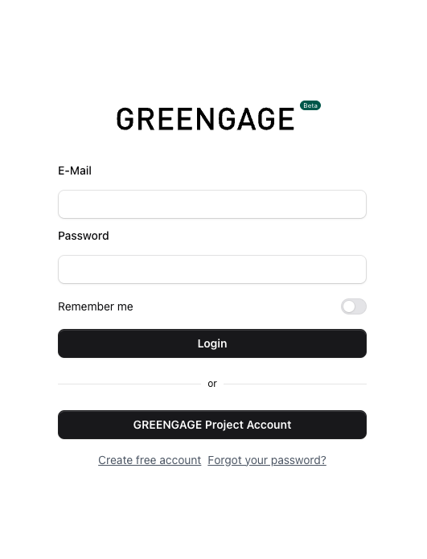
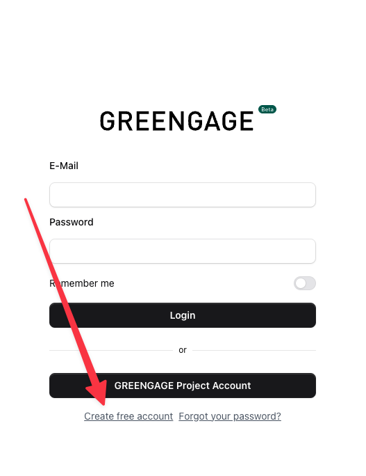
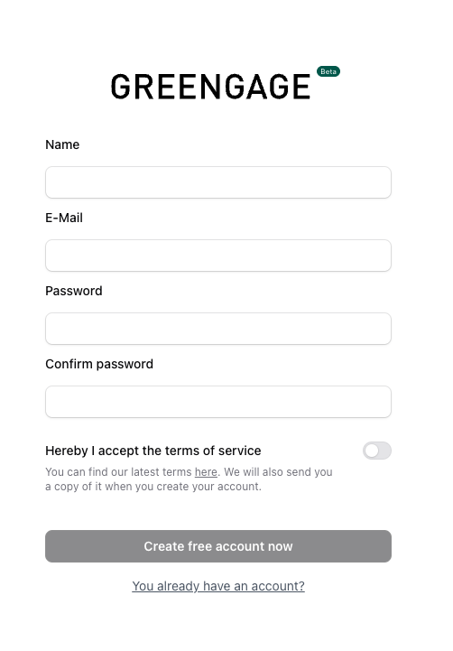

# GREENGAGE Console

The GREENGAGE Console is the administration interface for quickly and easily creating and managing Citizen Observatories. All you need is a free account.

**Console URL**: [console.greengage.dev](https://console.greengage.dev)

## Get Started

Getting started with the GREENGAGE Console takes just a few minutes. Currently, we support two ways to create a free account:

- **GREENGAGE Project Account** - Use your existing EU project credentials
- **Standalone Account** - Create a dedicated account with email and password

## Login

On the login screen, you can choose between:

1. **GREENGAGE Project Account** - If you are part of the GREENGAGE EU project, you can use your project credentials. First-time users will need to complete a consent form.

2. **Custom Credentials** - Use your standalone email and password.

## Create a Standalone Account

If you prefer not to use the GREENGAGE project account, you can create a standalone account.

### Step 1: Click "Create free account"

### Step 2: Fill out the registration form

You only need three things to register:

- **Name** - Your display name
- **Email** - A valid email address
- **Password** - A secure password

### Step 3: Verify your email

After submitting the form, you will receive a verification email. Click the link in the email to verify your account.

!!! note
    Email verification is not required if you use the GREENGAGE Project Account.

## Console Overview

Once logged in, you have access to the full administration interface:

| Section | Description |
|---------|-------------|
| **Dashboard** | Overview with statistics and recent activity |
| **Observatories** | Create and manage Citizen Observatories |
| **Tasks & Missions** | Define tasks for citizens to complete |
| **POIs** | Manage Points of Interest on the map |
| **Surveys** | Create and manage questionnaires |
| **Calendar** | Visual calendar view of all scheduled missions |
| **Templates** | Save and reuse mission configurations |
| **Schedules** | Set up recurring/automated missions |
| **News** | Publish announcements for your observatory |
| **Communications** | Send messages and notifications to participants |
| **Webhooks** | Configure external integrations |
| **Users** | Manage team members and permissions |
| **Settings** | Configure observatory settings |

---

## Features

### Dashboard & Statistics

The dashboard provides an overview of your observatory's activity:

- Total number of participants
- Completed missions and surveys
- Recent spots and submissions
- Activity trends

### Mission Templates

Save time by creating reusable mission templates:

- **Save as Template** - Convert any existing mission into a template
- **Create from Template** - Quickly create new missions based on saved templates
- Templates preserve all mission settings including surveys, POI assignments, and configurations

See [How to use Mission Templates](how-to-guides.md#mission-templates) for details.

### Mission Scheduling

Automate mission creation with the scheduling system:

- **Recurring Missions** - Set up daily, weekly, or monthly missions
- **Auto-Close** - Automatically close missions after a specified time
- **Calendar View** - Visualize all scheduled and active missions

See [How to set up Mission Schedules](how-to-guides.md#mission-scheduling) for details.

### News & Announcements

Keep your participants informed:

- Create news articles for your observatory
- Articles are displayed in the mobile app
- Support for rich text formatting

See [How to create News](how-to-guides.md#create-news) for details.

### Communications

Reach out to your participants directly:

- **Send Notifications** - Push notifications to app users
- **Contact Spot Users** - Respond to specific spot submissions
- **Communication Templates** - Save frequently used messages
- **Recipient Management** - Target specific user groups

See [How to send Communications](how-to-guides.md#send-communications) for details.

### Webhooks

Integrate with external systems:

- Receive real-time notifications when events occur
- Supported events: Mission completion, Spot creation, Survey submission
- Configure multiple webhook endpoints
- View webhook logs for debugging

See [How to configure Webhooks](how-to-guides.md#configure-webhooks) for details.

### Topics & Themes

Organize your content with custom themes:

- Create custom topics/themes for your observatory
- Assign colors using the visual color picker
- Filter content by theme in the mobile app

### Multi-language Support

The console supports multiple languages:

- English
- German (Deutsch)
- Spanish (Español)
- Italian (Italiano)

---

## Next Steps

After creating your account, you can:

1. [Create a Citizen Observatory](how-to-guides.md#create-an-observatory)
2. [Set up Tasks and POIs](how-to-guides.md#create-a-task)
3. [Configure Mission Templates](how-to-guides.md#mission-templates)
4. [Set up automated Schedules](how-to-guides.md#mission-scheduling)
5. Invite team members to collaborate

See the [How-to Guides](how-to-guides.md) for detailed instructions.
