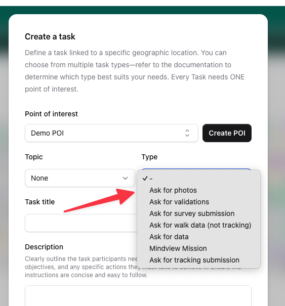

# How-to Guides

This section provides step-by-step instructions for common tasks in the GREENGAGE Console.

## Create an Observatory

A Citizen Observatory is the entry point for every mission and survey. It defines the geographic area where citizens can participate.

### First-time Setup

If this is your first time in the console and your account hasn't been invited to any other observatory team, you will see only a "Create Observatory" button. The only thing you need to enter is the name of the observatory.

<video autoplay muted loop controls width="100%">
  <source src="../assets/greengage-app/console/videos/create-observatory.mp4" type="video/mp4">
</video>

### Define the Observatory Region

After the initial prompt, you will be redirected to a map. On this map, you need to define the area of the observatory. This is important for the app because only data from this region will be loaded when users participate.

To define the region:

1. Click on the map
2. A rectangle will appear
3. Drag the corners to define the size
4. **Click Save** to confirm the boundaries

!!! warning "Important"
    If you don't save the region, your observatory will not have any boundaries, which means nothing will be loaded in the app.

<video autoplay muted loop controls width="100%">
  <source src="../assets/greengage-app/console/videos/define-region.mp4" type="video/mp4">
</video>

### Create Additional Observatories

If you already have an observatory, you can create another one using the menu in the upper left corner:

<video autoplay muted loop controls width="100%">
  <source src="../assets/greengage-app/console/videos/create-observatory-menu.mp4" type="video/mp4">
</video>

!!! tip
    There is no limitation on how many observatories can be created.

---

## Create a Task

Tasks are one of the core functions of the GREENGAGE App. They define what citizens should do at specific locations.

### Understanding the POI Concept

The GREENGAGE App requires every task to have a **Point of Interest (POI)**. A POI is at least the starting point for one single mission.

Key concepts:

- A POI can be used multiple times
- The relation is always: **1 Task = 1 POI**
- POIs need a location (latitude/longitude)

### Step 1: Navigate to Tasks

Go to the "Tasks and Missions" section and click on "Create Task". A prompt will guide you through the process.

### Step 2: Choose or Create a POI

If you have not created a POI yet, you can do so during the task creation process by clicking "Create POI". A POI needs a location which can be easily defined via our map integration.

<video autoplay muted loop controls width="100%">
  <source src="../assets/greengage-app/console/videos/create-poi-via-task.mp4" type="video/mp4">
</video>

### Step 3: Define Your Task

After defining the POI, the dialog will update with additional fields. The required fields are:

| Field | Description |
|-------|-------------|
| **Type** | The purpose of the task |
| **Position** | Latitude and longitude (from the POI) |

### Task Types

By choosing a type, you define the purpose of the task. The console supports a variety of task types:



| Type | Description | App Support |
|------|-------------|-------------|
| **Survey** | Complete a questionnaire | Yes |
| **MODE** | Transport mode detection | Yes |
| **Walk** | Walking route task | Yes |
| **Validation** | Validate existing data | Yes |
| **Rating** | Rate a location or service | Partial |
| **External** | Link to external service | Partial |

!!! note
    Depending on the task type, you may need to fill additional fields. For example, a Survey type requires you to set up a survey form.

---

## Delete an Observatory

Sometimes you need to delete an observatory, for example after finishing a project or when testing is complete.

!!! warning "Admin Only"
    Deleting an observatory can only be done by an admin.

### Steps to Delete

1. Go to the console
2. Navigate to the **Settings** area
3. Find the delete option

<video autoplay muted loop controls width="100%">
  <source src="../assets/greengage-app/console/videos/delete-observatory.mp4" type="video/mp4">
</video>

!!! danger "This action is permanent"
    Deleting an observatory will remove all associated data including tasks, POIs, and user submissions.

---

## Mission Templates

Mission templates allow you to save mission configurations for reuse, saving time when creating similar missions.

### Save a Mission as Template

1. Go to **Tasks & Missions**
2. Find the mission you want to use as a template
3. Click on the mission actions menu (three dots)
4. Select **Save as Template**
5. Give your template a name
6. Click **Save**

The template will now be available in the Templates section.

### Create Mission from Template

1. Go to **Templates** in the navigation
2. Find the template you want to use
3. Click **Create Mission**
4. Adjust any settings if needed (POI, dates, etc.)
5. Click **Create**

!!! tip
    Templates are perfect for recurring mission types like daily surveys or weekly data collection tasks.

---

## Mission Scheduling

Automate mission creation with the scheduling system to create recurring missions without manual intervention.

### Create a Schedule

1. Go to **Schedules** in the navigation
2. Click **Create Schedule**
3. Configure the schedule:
   - **Name** - A descriptive name for the schedule
   - **Template** - Select which mission template to use
   - **Frequency** - Daily, weekly, or monthly
   - **Start Date** - When to begin creating missions
   - **End Date** (optional) - When to stop
4. Click **Save**

### Schedule Options

| Option | Description |
|--------|-------------|
| **Daily** | Create a new mission every day |
| **Weekly** | Create missions on specific days of the week |
| **Monthly** | Create missions on specific dates each month |
| **Auto-Close** | Automatically close missions after a set duration |

### Enable/Disable Schedules

You can temporarily disable a schedule without deleting it:

1. Go to **Schedules**
2. Find your schedule
3. Toggle the **Active** switch

### Calendar View

The **Calendar** section provides a visual overview of all scheduled and active missions. Use it to:

- See upcoming missions at a glance
- Identify scheduling conflicts
- Plan your observatory activities

---

## Create News

Keep your participants informed with news articles that appear in the mobile app.

### Create a News Article

1. Go to **News** in the navigation
2. Click **Create News**
3. Fill in the article details:
   - **Title** - The headline of your article
   - **Content** - The full article text (supports formatting)
   - **Publish Date** - When the article should be visible
4. Click **Publish**

### Manage News

- **Edit** - Update existing articles
- **Delete** - Remove articles that are no longer relevant
- **Preview** - See how the article will appear in the app

!!! tip
    Use news articles to announce new missions, share results, or thank participants for their contributions.

---

## Send Communications

The communications system allows you to send messages and notifications to your observatory participants.

### Send a Notification

1. Go to **Communications** in the navigation
2. Click **Create Communication**
3. Configure your message:
   - **Subject** - The notification title
   - **Message** - The content of your notification
   - **Recipients** - Select who should receive it
4. Click **Send**

### Recipient Options

| Option | Description |
|--------|-------------|
| **All Users** | Send to everyone in the observatory |
| **Active Users** | Only users who have been active recently |
| **Specific Users** | Select individual recipients |
| **Mission Participants** | Users who participated in a specific mission |

### Contact Spot Users

You can directly respond to users who created spots:

1. Go to **Spots**
2. Find the spot you want to respond to
3. Click the **Contact User** action
4. Write your message
5. Click **Send**

### Communication Templates

Save frequently used messages as templates:

1. When creating a communication, click **Save as Template**
2. Give your template a name
3. Reuse it later by selecting from the template dropdown

---

## Configure Webhooks

Webhooks allow external systems to receive real-time notifications when events occur in your observatory.

### Create a Webhook

1. Go to **Webhooks** in the navigation
2. Click **Create Webhook**
3. Configure the webhook:
   - **Name** - A descriptive name
   - **URL** - The endpoint that will receive notifications
   - **Events** - Select which events trigger the webhook
   - **Secret** (optional) - A shared secret for verification
4. Click **Save**

### Supported Events

| Event | Trigger |
|-------|---------|
| **mission.completed** | When a user completes a mission |
| **mission.started** | When a user starts a mission |
| **spot.created** | When a new spot is created |
| **spot.updated** | When a spot is modified |
| **survey.submitted** | When a survey is submitted |
| **poi.created** | When a new POI is created |

### Webhook Payload

Webhooks send a JSON payload containing:

```json
{
  "event": "spot.created",
  "timestamp": "2025-12-19T14:30:00Z",
  "data": {
    "id": "123",
    "title": "Traffic Issue",
    "latitude": 48.2082,
    "longitude": 16.3738
  }
}
```

### View Webhook Logs

Debug webhook issues using the logs:

1. Go to **Webhooks**
2. Click on your webhook
3. View the **Logs** tab
4. See delivery status, response codes, and payloads

!!! info "Example Implementation"
    A reference implementation is available at [github.com/sushidev-team/greengage-webhook-example](https://github.com/sushidev-team/greengage-webhook-example)
