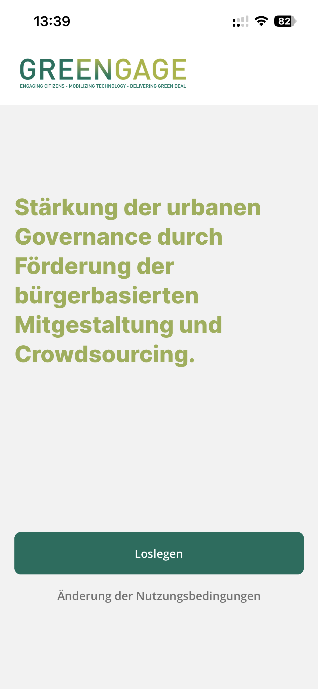
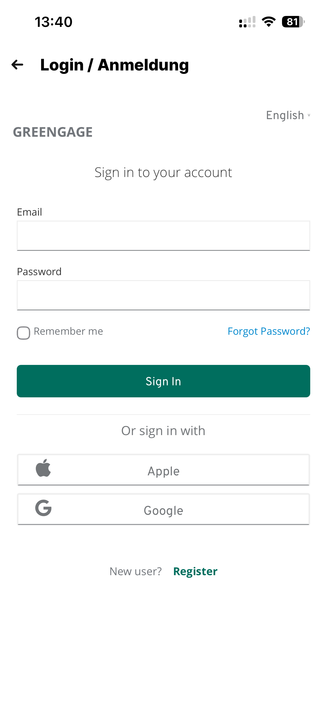
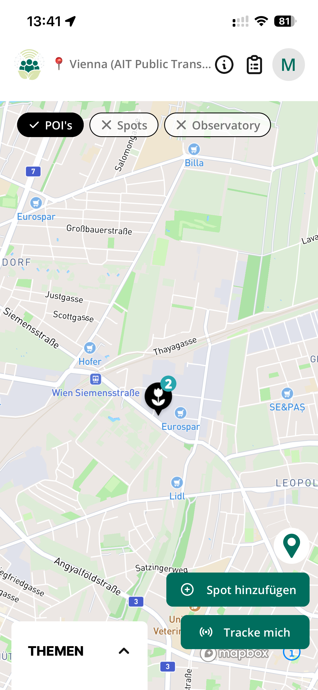
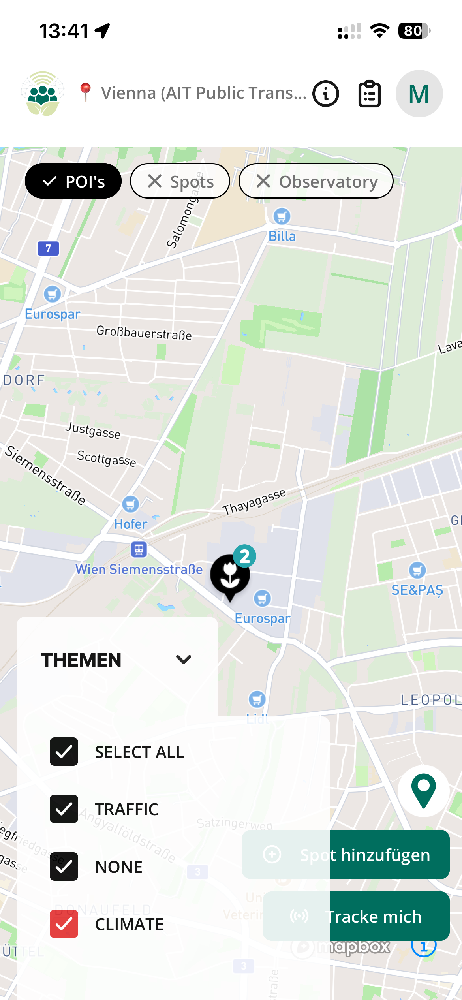
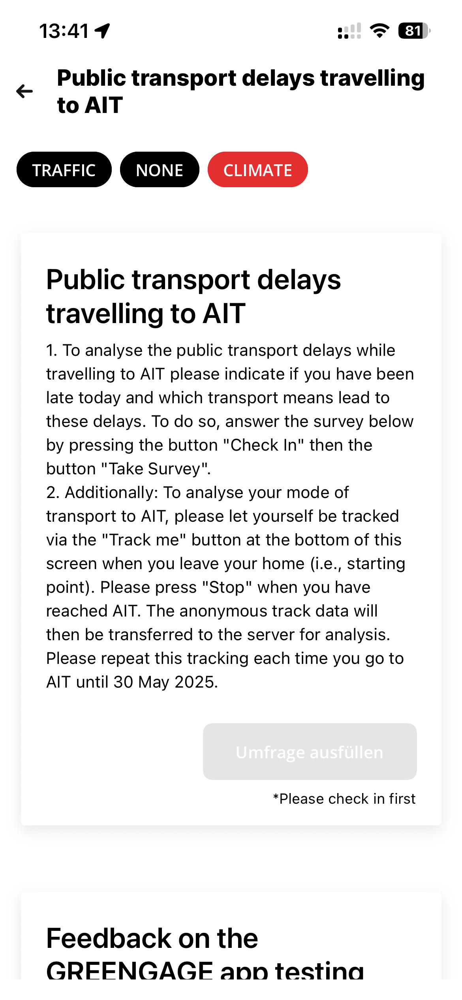
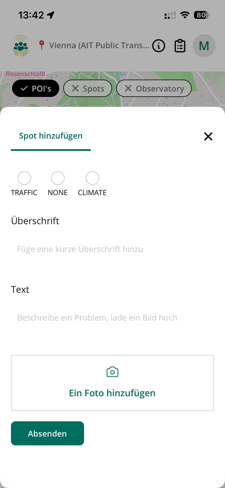
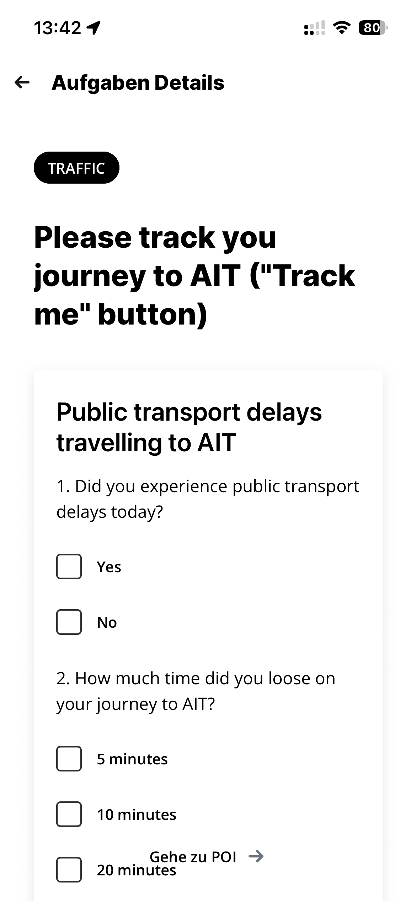
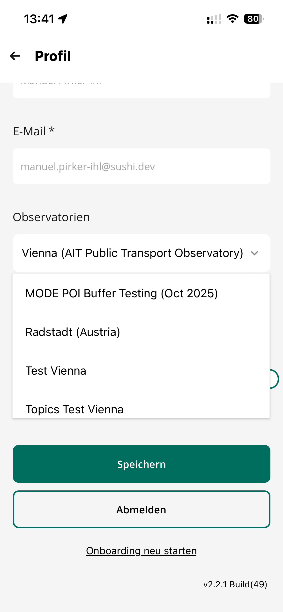

# GREENGAGE App

## Introduction

The GREENGAGE App is a mobile application for citizen engagement and crowdsourcing, designed to strengthen urban governance through citizen-based co-creation. The app enables citizens to participate in Citizen Observatories, report observations, track mobility patterns, and complete surveys.

## Availability

The GREENGAGE App is available for both major mobile platforms:

| Platform | Status |
|----------|--------|
| **Apple iOS** | Available on App Store |
| **Google Android** | Available on Google Play |

Both apps can be deployed and customized for your Citizen Observatory.

## Administration Console

The GREENGAGE Console at **[console.greengage.dev](https://console.greengage.dev)** is the administration tool for managing the GREENGAGE App infrastructure.

Key highlights:

- **Free to use** - The SaaS platform is available at no cost
- **Active development** - The platform will continue to be developed beyond the project duration
- **Easy setup** - Create and manage Citizen Observatories within minutes

For detailed documentation on the Console, visit the [GREENGAGE Console Documentation](https://console.greengage.dev/docs).

## App Screens

### Welcome Screen

The welcome screen introduces users to the GREENGAGE project mission: *"Strengthening urban governance through promoting citizen-based co-creation and crowdsourcing."* Users can tap "Get Started" to begin.

### Login / Registration

The app supports multiple authentication methods:

- **Email & Password** - Traditional account login
- **Apple Sign-In** - Quick authentication via Apple ID
- **Google Sign-In** - Quick authentication via Google account
- **New Registration** - Create a new account directly in the app

Multi-language support is available (e.g., English, German).

### Map View

The interactive map displays:

- **POIs** (Points of Interest) - Predefined locations relevant to the observatory
- **Spots** - User-reported locations
- **Observatory** - Current Citizen Observatory context

Key actions:

- **Add Spot** - Report a new observation at the current location
- **Track me** - Start mobility tracking for transport mode analysis

### Theme Filter

Users can filter map content by themes eg.:

- **TRAFFIC** - Traffic-related observations
- **CLIMATE** - Climate and environmental observations
- **NONE** - Uncategorized items
- **SELECT ALL** - Show all themes

Themes can be defined within the console.greengage.dev for every observatory on demand.

### Task Details

Tasks provide instructions for citizen participation. This example shows a public transport delay survey asking users to:

1. Check in at a location
2. Complete a survey about transport delays
3. Track their journey using the "Track me" feature

### Add Spot

Citizens can contribute observations by adding spots:

- Select a **theme category** (Traffic, Climate, etc.)
- Add a **title** for the observation
- Provide a **description** of the issue or observation
- **Upload a photo** to document the spot

### Survey

Integrated surveys allow structured data collection:

- Multiple choice questions
- Yes/No questions
- Time-based selections
- Navigation to related POIs

### Profile & Observatory Selection

The profile screen allows users to:

- View and edit their **email address**
- Switch between **Observatories** (e.g., Vienna, Radstadt, Test environments)
- **Save** changes or **Sign out**
- Restart the **onboarding** process

App version information is displayed at the bottom.

## Features Overview

| Feature | Description |
|---------|-------------|
| Multi-Observatory Support | Participate in multiple Citizen Observatories |
| Location Tracking | Track mobility patterns for transport analysis |
| Spot Reporting | Report observations with photos and descriptions |
| Surveys | Complete structured questionnaires |
| POI | Point of interest system |
| Tasks | Tasks system to interact with people |
| Theme Filtering | Filter content by categories |
| Multi-language | Support for multiple languages (EN, DE, ES, IT) |
| Social Login | Apple and Google authentication |
| MODE | Deep Integration of MODE |
| Communication | Tools to communicate with participants |
| Mission Templates | Save and reuse mission configurations |
| Mission Scheduling | Automate recurring missions |
| News & Announcements | Keep participants informed |
| Webhooks | Integrate with external systems |

---

## Infrastructure

The GREENGAGE App is built on a modern, scalable infrastructure designed for reliability and performance.

### Asset Storage - Fairu

All media assets (images, photos, documents) in the GREENGAGE App are managed by **[Fairu](https://fairu.app)**, a specialized asset management and storage solution.

**Key Features:**

| Feature | Description |
|---------|-------------|
| **Cloud Storage** | Secure, scalable storage for all uploaded media |
| **Image Processing** | Automatic optimization, resizing, and format conversion |
| **Blurring** | Privacy protection through automatic or manual image blurring |
| **NSFW Detection** | Automatic detection of inappropriate content |
| **CDN Delivery** | Fast global content delivery |

Fairu handles all asset uploads from the mobile app, including:

- Spot photos uploaded by citizens
- Profile pictures
- Survey attachments
- Mission documentation

!!! info "Custom Fairu Integration"
    Observatory administrators can configure custom Fairu credentials in the Console settings for dedicated storage management.

For more information about Fairu, visit **[fairu.app](https://fairu.app)**.

### API

The GREENGAGE backend provides a GraphQL API for all data operations. See the [API Reference](api.md) for complete documentation.

### Authentication

User authentication is handled via:

- **Keycloak** - OAuth-based authentication for GREENGAGE Project accounts
- **Native Auth** - Email/password authentication for standalone accounts
- **Social Login** - Apple and Google sign-in via Keycloak
