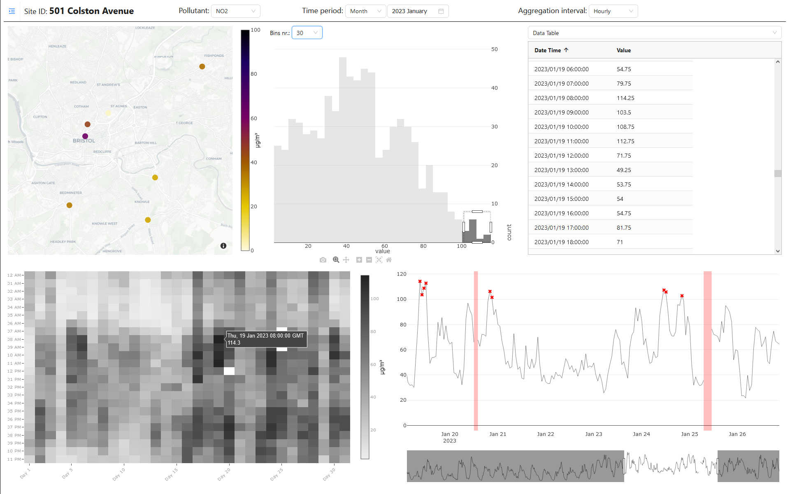

# Data Quality Dashboard

### Introduction

The data quality dashboard is a web-based tool that allows users to monitor the quality of collected data.
It provides both visual and numeric representations of data quality through visual cues, quality metrics, and statistics, allowing users to quickly identify potential issues.
The dashboard also offers a variety of features for data exploration and analysis, including the ability to filter data
by time, location, and other parameters.

### Features of Data Quality Dashboard

- **Interactive Dashboard**: The dashboard reacts to user input, allowing them to interact with the data and the selection
  of graphs and charts.
- **Data Quality Visualisation:** The dashboard provides visual cues to highlight data quality issues, such as missing
  values, outliers, and inconsistencies.
- **Data Preview:** Users can preview current data in a tabular format, allowing them to quickly identify potential issues.
- **Data Quality Metrics:** It offers a variety of data quality metrics, including completeness, accuracy and consistency.
- **Descriptive Statistics:** The dashboard provides descriptive statistics window for better understanding of the data in question.
- **Data Filtering:** Users can filter data by time, location, and other parameters to perform in-depth analysis.
- **Data Export:** The dashboard allows users to export data in various formats, including CSV, JSON, and Excel.

### [Use Case Scenario](#UseCaseScenario)

#### Context:

In an urban citizen observatory, members of the community actively participate in monitoring and analysing environmental
conditions. One of the critical concerns in many cities is air quality, which directly impacts public health and quality
of life.

#### Objective:

To monitor, analyse, and visualise air quality data across different parts of the city to identify pollution hotspots,
understand temporal trends, and engage the public in environmental awareness and decision-making processes.

#### Implementation Using Data Quality Dashboard:

1. Data Collection:

   - Deploy HOPU sensors across the city to measure air quality indicators like PM2.5, PM10, NO2, CO2, and Ozone.
   - Sensors transmit data to a centralised database, storing time-stamped readings and location data.

2. Data Integration with Data Quality Dashboard:

   - Connect the dashboard to the database where sensor data is stored.

3. Exploratory Data Analysis:
   - Use the dashboard to explore data quality issues, such as missing values, outliers, and inconsistencies.
   - Identify potential causes of data quality issues, such as sensor malfunction or data transmission errors.
   - Use the insights to improve data collection processes and ensure data quality.
