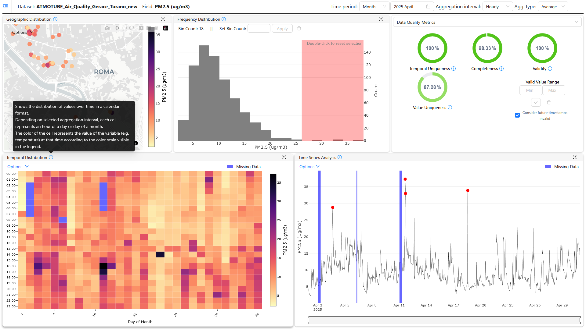

# Data Quality Dashboard

### Introduction

The Data Quality Dashboard is a web-based tool for monitoring, analyzing, and visualizing the quality of time-series data. It provides a comprehensive suite of features to identify potential data issues through interactive visualizations, statistical analysis, and calculated quality metrics. Users can perform in-depth exploratory analysis by filtering data by time and other categorical parameters, helping to ensure the reliability and integrity of their datasets.

### Features of Data Quality Dashboard

- **Interactive Dashboard**: A fully reactive interface that allows users to dynamically explore data through interactive graphs and charts.
- **Advanced Visualizations**: Includes a variety of visualization panels for comprehensive analysis:
    - **Trend Line Plot**: To observe data patterns and anomalies over time.
    - **Histogram**: To understand the distribution of data values.
    - **Map Plot**: To visualize the geographical distribution of data.
    - **Calendar Heatmap**: To identify temporal patterns and data gaps.
- **Data Quality Metrics:** The dashboard automatically calculates and displays key data quality dimensions:
    - **Completeness**: Measures the presence of data over expected intervals.
    - **Validity**: Assesses if data points fall within specified, valid ranges.
    - **Uniqueness**: Identifies the proportion of duplicate records in the data.- **Descriptive Statistics:** Provides a statistical summary of the selected data, including mean, median, standard deviation, and quartiles.
- **Cross-Filtering**: Selections in one visualization panel (e.g., the histogram) are automatically highlighted in other panels, enabling linked-view analysis.
- **Data Filtering & Aggregation:** Users can filter data by time and other parameters, and aggregate data over various intervals (e.g., hourly, daily) to analyze trends at different granularities.
- **Data Preview:** Offers a tabular view for users to inspect raw data values directly.

### [Use Case Scenario](#UseCaseScenario)

#### Context:

In an urban citizen observatory, members of the community actively participate in monitoring and analysing environmental
conditions. One of the critical concerns in many cities is air quality, which directly impacts public health and quality
of life.

#### Objective:

To monitor, analyse, and visualise air quality data across different parts of the city to identify pollution hotspots,
understand temporal trends, and engage the public in environmental awareness and decision-making processes.

#### Implementation Using Data Quality Dashboard:

1. Data Collection:

    - Deploy sensors to measure air quality indicators like PM2.5, PM10, NO2, CO2, and Ozone.
    - Sensors transmit data to a centralised database, storing time-stamped readings and location data.

2. Data Integration with Data Quality Dashboard:

    - Connect the dashboard to the database where sensor data is stored.

3. Exploratory Data Analysis:
    - Use the dashboard's **Trend Line** and **Calendar Heatmap** to visualize the completeness of the sensor data and identify any gaps in transmission.
    - Use the **Histogram** and **Descriptive Statistics** to understand the distribution of pollutants and check for validity against known environmental standards.
    - Leverage the **Map Plot** to visualize pollution concentrations across the city, identifying potential hotspots.
    - Use the insights to improve data collection processes, schedule sensor maintenance, and ensure overall data quality.
