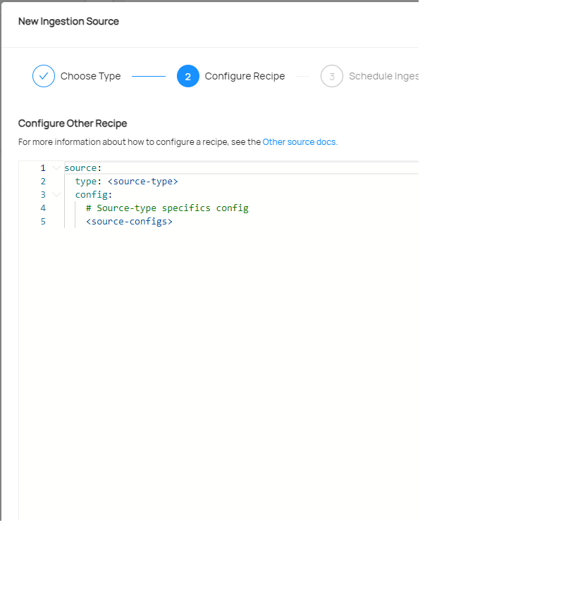
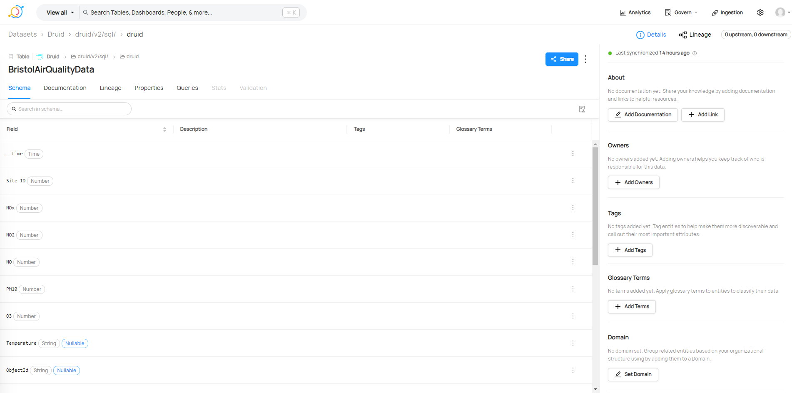
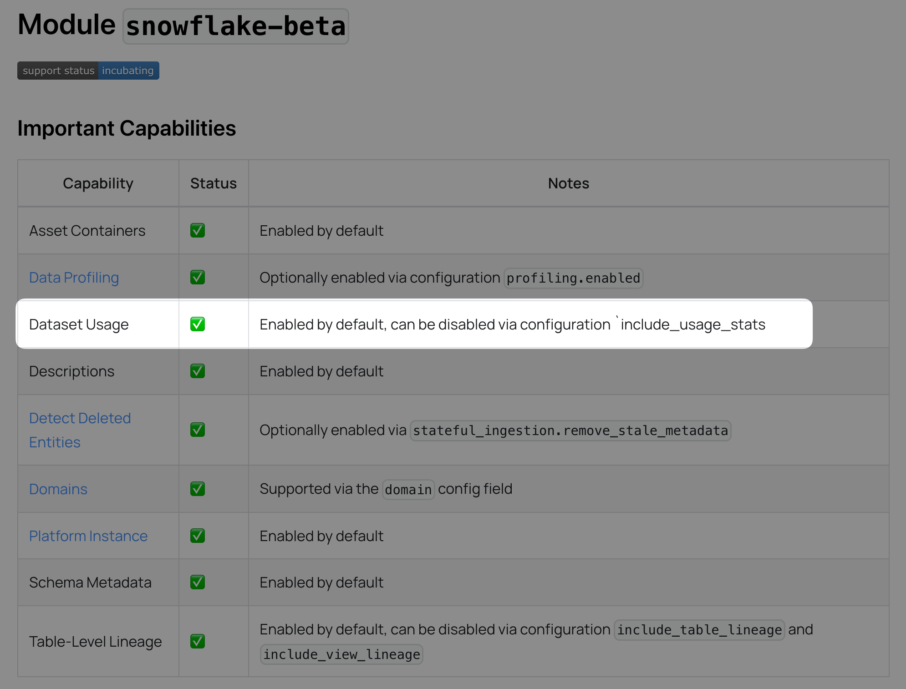
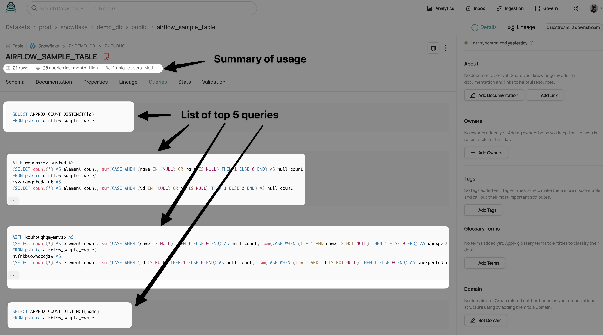

# DataHub example of Integration

## Creating an Ingestion Source

### Introduction

In this example we will show how to create an ingestion source that pulls data from the desired platform to DataHub.

### Prerequisites

- Access to [DataHub](https://datahub.greengage-project.eu/)
- Access to the platform to be integrated with DataHub
- Check if the platform to be integrated with DataHub is already supported by Datahub. [List of ingestion sources](https://datahubproject.io/integrations)

### Creating the recipe

1) Access to [DataHub](https://datahub.greengage-project.eu/)
2) Go to the [Ingestion view](https://datahub.greengage-project.eu/ingestion) and click in create new source.
3) Select the platform to be integrated with DataHub.
4) Fill the form with the information of the platform to be integrated with DataHub. Some of the platforms have forms to be fulfilled with the information of the platform to be integrated with DataHub. In other cases, the information is provided in a yaml style as shown in the following figure:

5) Schedule the ingestion of data as shown in the following figure:

6) Click in *Save & Run* source and the ingestion will start.

## Adding metadata to the datasets

1) Access to [DataHub](https://datahub.greengage-project.eu/)
2) Access to the desired dataset
3) You can edit the metadata of the dataset in the column shown at the right side of the following figure and *descriptions*, *tags* and *glossary terms* can be added to the dataset fields: 

4) In the documenation tab, the documentation of the dataset can be added directly in formatted text or via a link to the documentation of it.
5) The lineage tab allows to edit the lineage of the dataset. 
6) The queries tab allows to add the most common queries conducted to the dataset. However, this queries cannot be executed from DataHub.

## Dataset Usage & Query History

Altough is not possible to execute queries from DataHub, it is possible to add the usage and query history of the dataset. Some ingestion sources have the option to add the usage and query history. To see if our desired source has this option enabled we should check the documentation for it in the [DataHub website](https://datahubproject.io/docs/). This figure shows the option that should be present to have the Dataset Usage enabled:

If the option is enabled, the usage and query history of the dataset will be shown in the dataset view as shown in the following figure:

