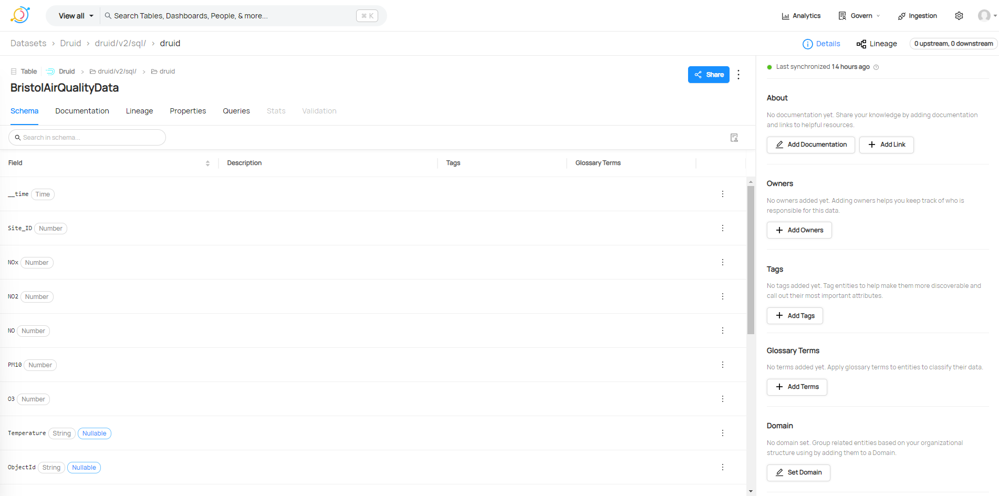

# DataHub Usage Guide

To provide a centralised location for all data assets, we are deploying DataHub in a centralised manner. This means that all data assets will be catalogued in a single instance of DataHub. This usage guide provide instructions on how to use DataHub.

**Step 1: Requesting Credentials**

- Access to [DataHub](https://datahub.16.171.94.204.nip.io/) using your Google account or the account created for Greengage project and registered in Keycloak.

<!-- - TODO SPECIFY THE DIFFERENT ROLES AND THE ACTIONS THAT CAN BE PERFORMED WITH EACH ROLE. -->

- Send an email to ruben.sanchez@deusto.es with the subject line: "[GREENGAGE] Request for rights in DataHub" including the following information:
  - Tool name.
  - Contact name:(for technical propose)
  - Contact email:(for technical propose)

Once you have the credentials and the right access rights you can start using DataHub.

**Data Discovery and Search**

You can search for any asset located in DataHub using the search bar located on the main page or at the top of any other page within DataHub. The search bar, as shown in the figure below, enables users to quickly find relevant datasets, metrics, and dashboards.

**Metadata Management**

DataHub offers comprehensive metadata management capabilities. It aggregates and manages metadata from a variety of data sources, maintaining details about datasets, schemas, data lineage, and ownership. This feature is illustrated in the Metadata Management interface, providing a clear overview of all metadata assets.

**Data Lineage and Governance**

DataHub visualises data lineage, showing how data flows through various systems. This feature is crucial for understanding the transformation and lifecycle of data, aiding in governance and compliance. The Data Lineage interface provides a graphical representation of these data flows.

**Collaboration and Documentation**

The platform enhances collaboration among data teams by allowing for the documentation and sharing of insights about datasets. The Collaboration and Documentation interface facilitates this exchange, fostering a data-informed culture.

