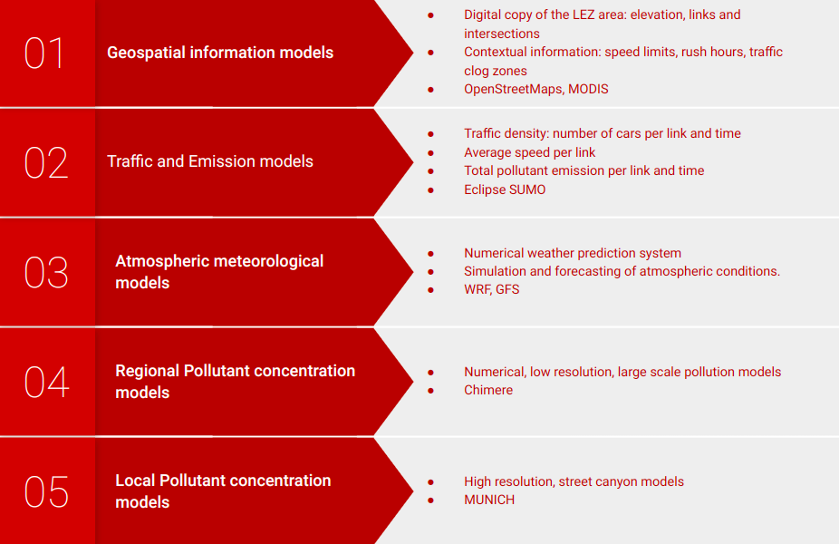
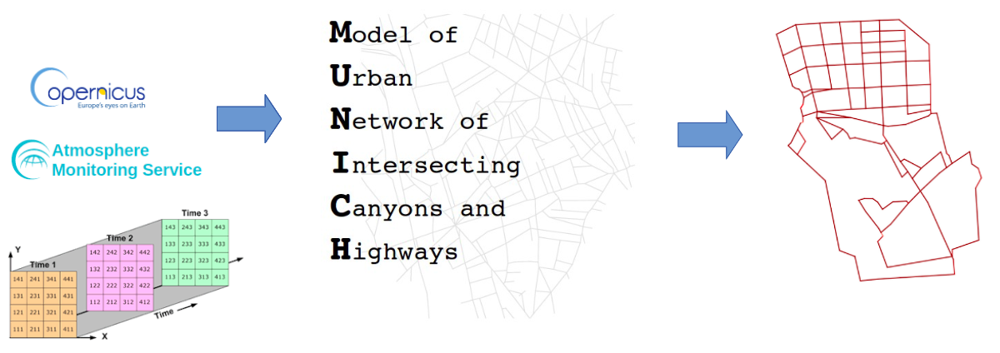
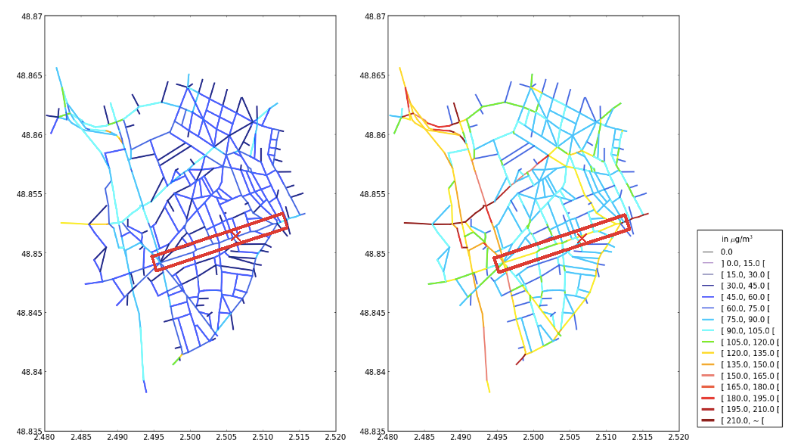
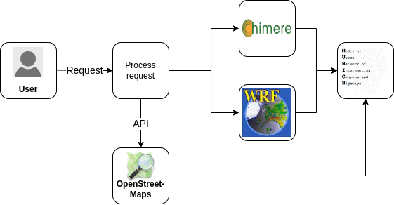
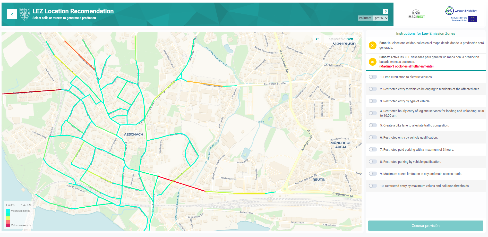

# Downscaling

### Introduction

Downscaling is a numerical modeling tool that allows quantifying the level of pollution in cities. This tool is capable of integrating different data sources such as geospatial information, traffic data, COPERNICUS data, and regional atmospheric (WRF) and pollution (CHIMERE) models to calculate pollution levels in cities with high street-level resolution using a street canyon model MUNICH.

This tool assists administrations in decision-making and plays a crucial role in the era of digital transformation by creating digital twins of cities.

### Features of Downscaling

#### Prerequisites

To compile the tool, some prerequisites relating to the computing resources are necessary.

* Linux system operating system
* CPU with 8-16 cores
* 32 GB RAM

To download the MUNICH model, please, see the documentation [here](https://github.com/cerea-lab/munich), where you can find all the dependencies and libraries necessary.

1. Multisources data integration.

The tool is capable of integrating traffic data from various cities, pollution data from COPERNICUS or satellite sources (SENTINEL 5 and 7), terrain elevation, and building geometry, among other information.

  
  
Figure 1: Different kinds of sources that the tool are available to use

These input data are typically provided in netCDF file format for the model to recognize and integrate.

2. Advanced numerical model MUNICH.

Based on all received data sources, Downscaling tool utilizes *MUNICH* (Model of Urban Network of Intersecting Canyons and Highways), an advanced numerical model that calculates the concentration of pollutants such as CO, NO, CO2, O3, NO2, particulate matter and black carbon.

  
  
Figure 2: General diagram of downscaling superresolution architecture.

  
  
Figure 3: Example of MUNICH pollutant calculation.

3. Geospatial analysis.

The tool enables spatial analysis of pollution, facilitating the identification of critical areas where high concentrations of pollutants are found to develop mitigation measures.

4. Real-time data.

Capable of generating and displaying real-time results, including simulations for the future and simulations over an extended period.

5. Outputs and Interactive Visualization.

The model provides results in netCDF files, which are subsequently processed to offer an interactive visualization showing the concentration of various pollutants in the city. Concentration values are displayed for each street.

  
  
Figure 4: Workflow of the tool.

### Use case

This is a case study in the city of Lindau (Germany) that illustrates how the tool operates, the results it produces, and the visualization it provides.

In this visualizer, you can see the concentration level of each street, as well as apply different types of restrictions in the city to see the effect they have.

  
  
Figure 5: Example of real use case in the city of Lindau.

Online visualizer can be found in this [link](https://lez.hopu.eu/d/azOD3G7Sz/cuadro-de-mando-medio-ambiente?orgId=1&kiosk)

Another example in the city of Cartagena is available in this [link](https://lez.hopu.eu/d/RD2OiEgIk/cuadro-de-mando-medio-ambiente?orgId=1&kiosk)

### References

* MUNICH documentation can be found [here](https://cerea.enpc.fr/munich/doc/munich-guide-v2.pdf)

    
