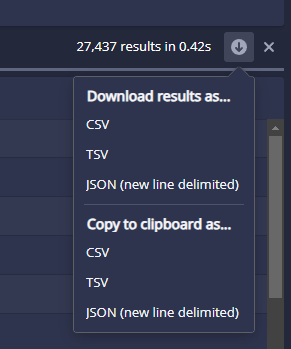

# Apache Druid Usage Guide 

Apache Druid offers a variety of ways to ingest data. The most common way is to use the native batch ingestion system. This system is designed to handle large amounts of data and is the recommended way to ingest data into Druid. This usage guide provide instructions on how to use Apache Druid.

**Step 1: Log In**
- Access to the [Druid](https://druid.greengage-project.eu/) deploy of Greengage.
- First of all, you should login using your Greengage login in the keycloak authentication webpage that will appear.
- You will reach to the main view of the tool as shown in the figure below.


**Step 2: Loading data**

- Click on the **Load data** button at the top menu. Here we have several options, however, we will use the **Batch - SQL** option. This will bring us to the view shown in the figure below.


- Apache Druid offers us several options to load data, from several online providers to local files. In this example we will employ a HTTPS URL to load the data from an Open API. However, you can use any option since the process is the same.


- Once we introduced the URL, we should click on the **NEXT** button at the bottom-right part of the view. This will bring us to the view shown in the figure below. In this step we should configure the data ingestion settings (usually Apache Druid detects them automatically). However, there is an **important setting** that we should configure: the **timestamp**. This setting is the one that will be used to order the data in the database. In this case, we will use the `month` field because the rows do not have a timestamp field. Once we have configured the settings, we should click on the **NEXT** button at the bottom-right part of the view.


- Subsequently, Apache Druid will identify the type of each column automatically. However, we can change the type of each column or add new ones if we want. Once we have configured the settings, we should click on the **Start loading data** button at the bottom-right part of the view.


- The loading of data is done in separated tasks. Once all the tasks are finished, the data will be available in the database. You can check the status of the task in the **Tasks** button at the top menu.

**Step 3: Check datasources**

- Click on the **Datasources** button at the top menu. In this view, you can visualise the different datasources that you have in the database. 


- When you click on a datasource, you will be able to see the different columns that it has. Furthermore, you can see the different values that each column has. In this view you can also conduct different actions to the datasource, such as, edit the several performance settings or delete it.


**Step 4: Querying datasources**

- Click on the **QUERY** button at the top menu. This view will allow you to query the different datasources that you have in the database. At the left part of the view, all the available datasources are shown. In the middle part of the view, you can write the query that you want to execute. After that, you should click on the **Run** button at the middle-left part of the view. The results of the query will be shown at the bottom part of the view. 


**Extra: Explore datasources**

- Click on the **THREE DOTS** at the rightmost part of the top menu. Then, click on the **Explore** button. This view will allow you to explore the different datasources that you have in the database. At the left part you should select the datasource that you want to explore and in the right part you may choose the chart type and its configuration. After that, you should select the desired column to explore. Finally, you can add several filters at the top part of the view. 


# Download data from Apache Druid

**Step 1: Go to query section**

- Click on the **QUERY** button at the top menu. 


**Step 2: Write the query**

- Create a query to select the data that you want to download. In this case, we will download all the data from the `test` datasource. 

```sql
SELECT * FROM test
```

**Step 3: Run the query**

- Click on the **Run** button at the middle-left part of the view. The results of the query will be shown at the bottom part of the view. 
- **VERY IMPORTANT!** You should uncheck the **Limit inline result** option in the engine configuration. This option is shown in the figure below.


**Step 4: Download the data**

- Finally, at the right-most part of the screen, click on the down pointing arrow and download the data in the desired format.

