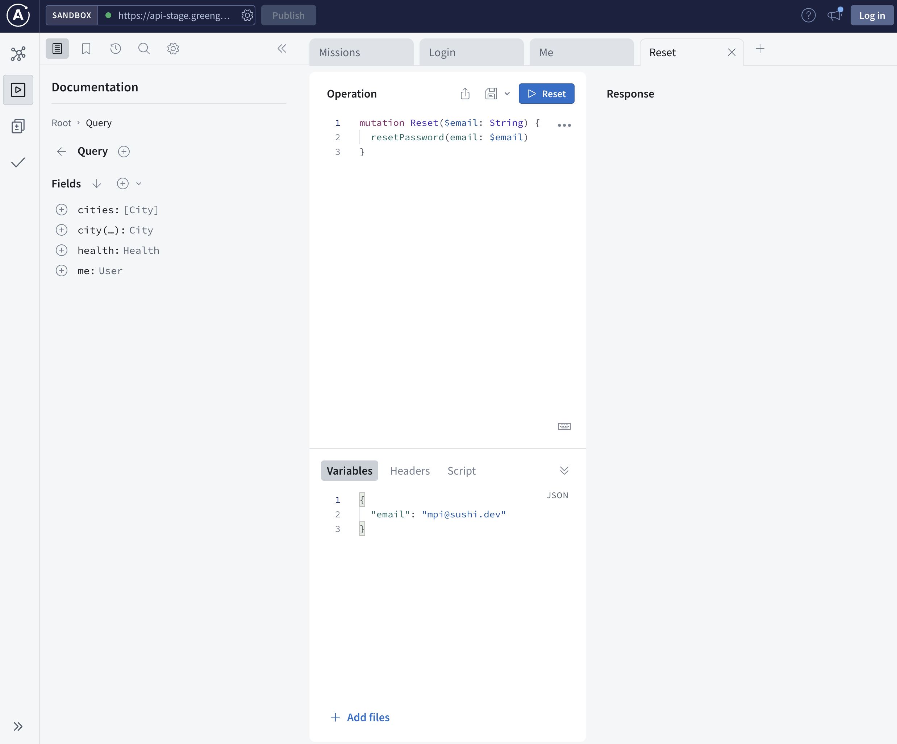
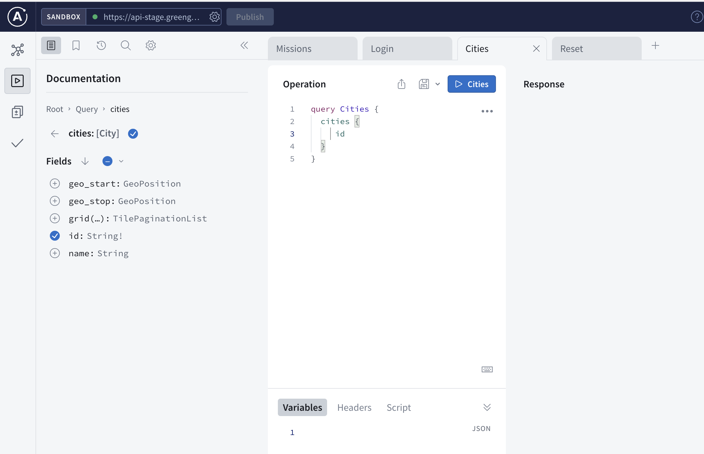

# Greengage APP API

### Introduction:
The greengage app api is mesh of multiple services which are provided via a single gateway.

### Endpoints

Staging:
```
https://api-stage.greengage.dev/graphql
```

Prouction (available January 2024):
```
https://api.greengage.dev/graphql
```

### Datastudio



The endpoints always a control-panel under /cp which allows you open the complete documenation of the active connected services

eg. https://api-stage.greengage.dev/cp

### Technology

Due to the fact that the (micro-)services are made accessable via the Apollo Server the location, storage of each service is masked by the gateway.

#### GraphQL

GraphQL is like a superhero of data query languages, swooping in to save the day for developers tired of over-fetching or under-fetching data. Created by Facebook, this query language provides a more efficient and flexible alternative to traditional REST APIs. With GraphQL, you get to specify exactly what data you need, and you'll receive it in a neat JSON package, eliminating the excess baggage of unnecessary information. It's like ordering a customized pizza instead of settling for a pre-made slice—you get exactly what you asked for, and nothing more.

GraphQL provides various type of interactions but the most important are
- queries
- mutations

#### Queries

To get data out of the API you make a "query". The datastudio can help you write meaningful queries and helps you find out what the services can do, without you knowing anything about the location or the queries.



Example:
```graphql 
query Cities {
    cities {
        id
        name
    }
}
```

#### Mutations

Mutations on the other hand are the WRITE/UPDATE/DELETE operations. Or in simple terms every time you send data to the service which should taken care of.

Example:
```graphql
mutation RegisterAccount {
  register(data:{
    email:"mpi@sushi.ev"
  }) {
    token
    refresh_token
  }
}
``````