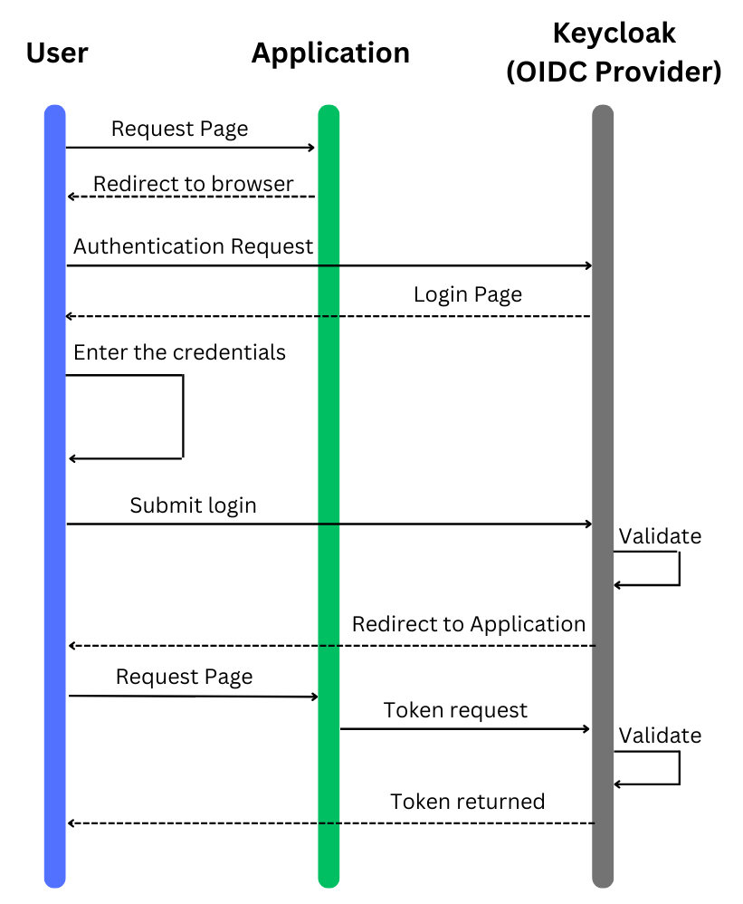

# Keycloak

## Setting Up a Development Environment: Guide to Integrating Keycloak

### Introduction:

In today's rapidly evolving tech landscape, ensuring the security of your applications is paramount. As you venture into developing or enhancing your application, integrating a robust authentication and authorization mechanism is crucial. This tutorial aims to guide you through setting up a development environment by integrating Keycloak, an open-source Identity and Access Management solution. Whether you're working on a brand new project or improving an existing one, following this guide will provide a solid foundation for securing your application using Keycloak.

### Features Keycloak:

1. **Single Sign-On (SSO) & Sign-Out:** Keycloak facilitates SSO and Single Sign-Out, allowing users to log in once and access various applications without needing to log in again.

2. **Standards-Based:** Keycloak supports standard protocols for authentication and authorization such as OpenID Connect, OAuth 2.0, and SAML 2.0, ensuring compatibility with various systems.

3. **User Federation:** It allows user federation with a variety of sources including LDAP and Active Directory, enabling you to manage users and their roles centrally.

4. **Customizable:** Keycloak is highly customizable, offering a broad range of options to tailor authentication and authorization flows to meet your specific requirements.

5. **Scalable:** It is designed to be scalable, catering to both small applications and large enterprise solutions with millions of users.

6. **Role-Based Access Control (RBAC):** Keycloak provides fine-grained authorization and role management, enabling you to control who has access to what in your applications.

7. **Multi-factor Authentication (MFA):** It supports multi-factor authentication, enhancing security by requiring users to provide multiple forms of identification before gaining access.

8. **Social Login:** Keycloak supports social logins, allowing users to log in using their social media accounts which can enhance user experience and increase adoption rates.

9. **Easy to Integrate:** With a variety of client adapters and libraries, integrating Keycloak with your application is straightforward regardless of the technology stack you're using.

10. **Support and Community:** Being an open-source project, Keycloak has a vibrant community and a wealth of resources available to help you throughout your integration journey.

### Use case

The following diagram show the sequences for an user auythentication procress using Keycloak as an OpenID Connect (OIDC) provider

1. The User initiates the process by requesting a page from the Application.
2. The Application then redirects the User to a browser for authentication.
3. The browser initiates an Authentication Request to Keycloak.
4. Keycloak presents a Login Page to the User.
5. The User enters their credentials into the login page.
6. The credentials are submitted back to Keycloak for validation.
7. Upon successful validation, Keycloak redirects the User back to the Application.
8. The Application makes a Token Request to Keycloak.
9. Keycloak validates the request and, if valid, returns a Token to the Application.
10. With the Token, the User is granted access to the requested page within the Application.

