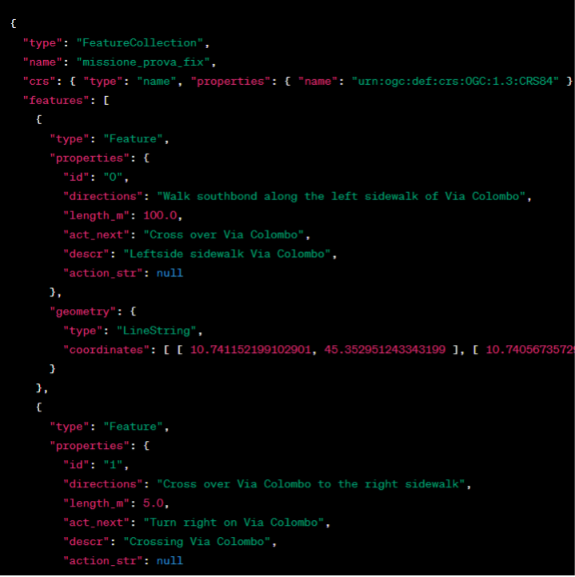
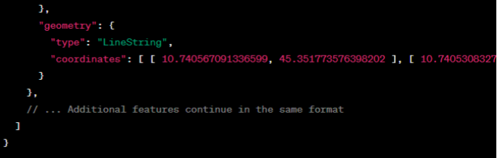

# MindView <> Greengage App Integration
To streamline user interactions and mission management between different crowd-based data collection tools, a dedicated integration protocol of the MindEarth App and the GREENGAGE App is implemented. The implementation of a dedicated protocol ensures availability and visibility of MindEarth’s missions across both apps, with seamless redirection for mission execution.
This means that any mission available in the MindEarth App will also be visible in the GREENGAGE App and that users of the GREENGAGE App will be able to select a MindEarth App mission and be redirected to the MindEarth app to complete the booking and mission execution and upload process, as well as to know, in real time the status, duration, reward and deadline of MindEarth App’s missions. This involves using two main systems based on webhooks and deeplinks.
## Webhook
A webhook functionality for actions like booking, canceling, and completing missions. These webhook interactions use the base path https://mindearth.greengage.dev/ (example url). 

1. Mission Add Interaction: 
Action: Adding new Mission on MindEarth App 
URL: https://mindearth.greengage.dev/mission/add 
Method: POST 
Header: Bearer <token>
payload:

 
2. Mission Booking Interaction: 
Action: Booking a Mission on MindEarth App 
URL: https://mindearth.greengage.dev/mission/<mission_id>/book 
Method: PUT 
Header: Bearer <token> 
3. Mission Cancellation Interaction: 
Action: Canceling a Mission Reservation on MindEarth App 
URL: https://mindearth.greengage.dev/mission/<mission_id>/book/cancel 
Method: PUT 
Header: Bearer <token> 
4. Mission Completion Interaction: 
Action: Completing a Mission on MindEarth App 
URL: https://mindearth.greengage.dev/mission/<mission_id>/complete 
Method: PUT 
Header: Bearer <token> 
5. Back-Office Integration: 
Action: Adding New Missions 
URL: https://mindearth.greengage.dev/mission 
Method: POST 
Header: Bearer <token> 
Body: Details provided in the relevant JSON structure documentation. 
 
## Deep links
Deeplinking is planned to facilitate user transition between GREENGAGE and MindEarth apps. Deep links in each mission would enable seamless transition from the GREENGAGE App and engagement with the MindEarth App. A query URL will provide a unique webhook link for each mission, eliminating the need for an Auth-Header due to the signed nature of the request. Example of Deep Link:
 mindearth://mission/23?callback=https%3A%2F%2Fmindearth.greengage.dev%2Fmission%2F23%3Fsignature%3Df834ed8570e05de6c50ad10bd6abcf71e9867fcb14bdf2670b4bf572ce346f3b 

# Testing
You can find here some [sample output data] (assets/sample_data)
We can give you [early access to the APK] () and create sample missions around your location if you want to test the app and there are no active missions in your vicinity
# Support and Contact
If you have any questions or require technical support, do not hesitate to contact our support team at [support@mindearth.ch] (support@mindearth.ch).
