# MindView Usage & Integration Guide for Third-Party Services

## MindEarth App (GREENGAGE Edition)

If you're interested in participating in the MindView project by using the MindEarth App, here's a detailed guide to help you get started:

### Step 1. Downloading and Installing the App

**Download the app**: Download the MindEarth App on the Google Play Store, or if it’s not yet available there, download the APK file from the link provided in the resources section.
[download app](https://play.google.com/store/apps/details?id=ch.mindearth.mindviewgreengage&hl=en)
**Install the App**: Install the app on your Android smartphone. If you're installing via an APK file, make sure to allow installation from unknown sources in your phone's settings.

### Step 2. Setting Up Your Account

**Launch the App**: Open the MindEarth App on your device. Please note that for the app to function correctly, you need to give it permission to track your precise location, access your camera, microphone, and storage.
**Register or Log In**: Create a new account if you're a first-time user, providing necessary information including payment details to receive compensation for completed missions. If you're a returning user, simply log in with your credentials.
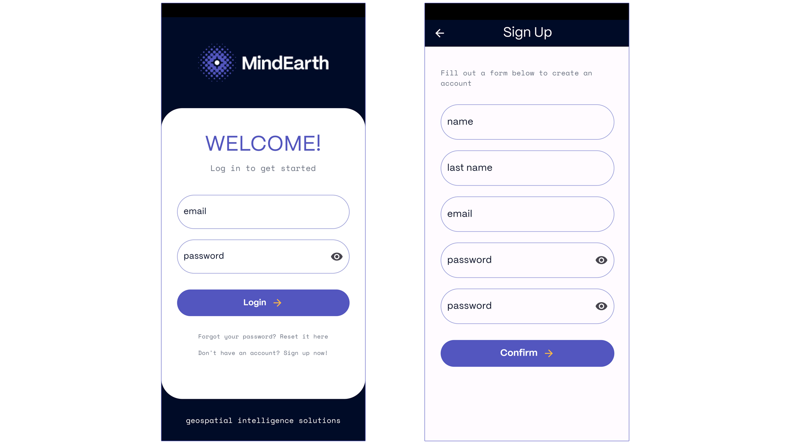

### Step 3. Exploring Available Missions

**Browse Missions**: Once logged in, you can browse through the list of available missions. These missions are typically commissioned by third parties for research, urban planning, or commercial purposes.
**View Mission Details**: For each mission, you can view detailed information such as the location, the task involved, duration, the device required, deadline, and the compensation offered.
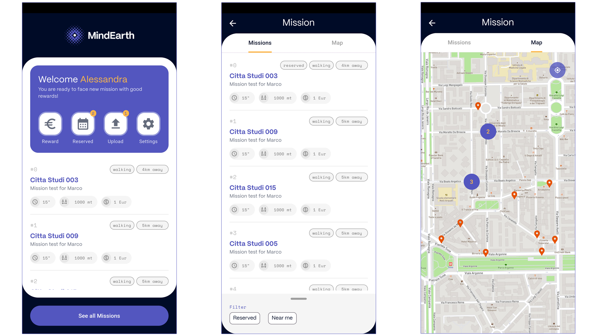

### Step 4. Selecting and Carry out a Mission

**Choose a Mission**: Select a mission that interests you and fits your availability. Carefully read the mission instructions, including any specific routes to follow or objects to photograph.
**Start the Mission**: When you're ready and at the mission's start location, begin the mission by tapping the 'Start' button. This action automatically activates your camera, and it starts taking pictures as per the mission's requirements.
**Complete the Tasks**: Follow the app's instructions closely, ensuring that all necessary photos are taken as per the mission guidelines.
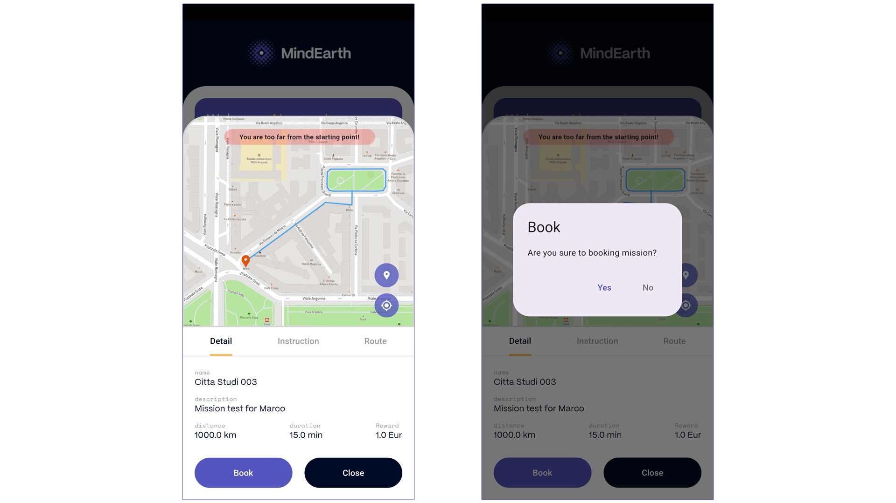

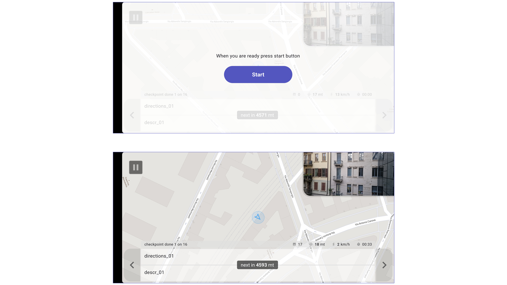

### Step 5. Uploading Data and Getting Rewards

**Upload Your Data**: After completing the mission, follow the prompts to upload the images collected to the MindEarth servers.
**Receive Compensation**: Based on the mission's guidelines and your performance, you will be compensated. This could be in monetary form or other rewards as specified in the mission details. Compensation for the mission will be processed on monthly bases based on the payment information provided during registration.
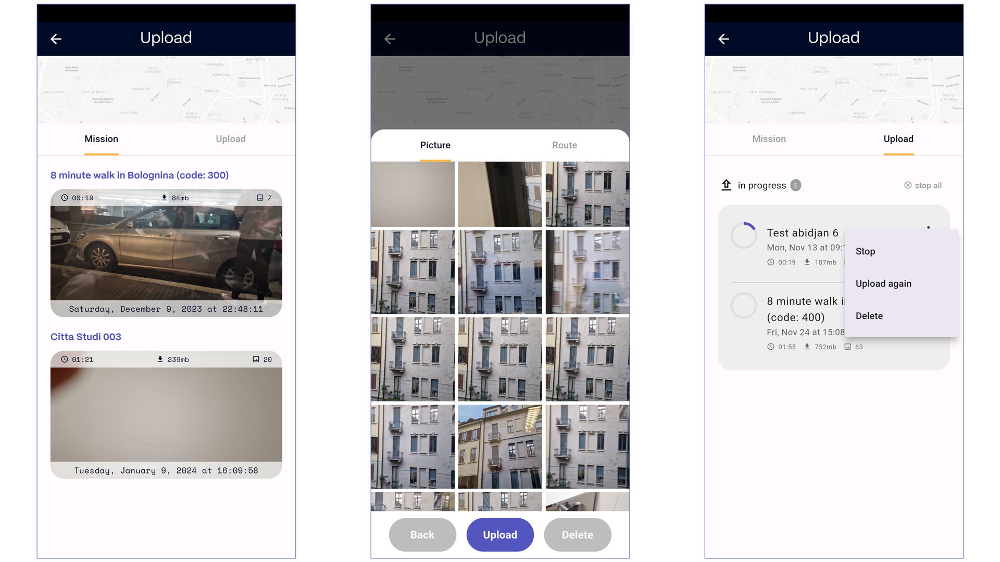

### Step 6. Review and Repeat

**Track Your Performance and Progress**: You can review your completed missions and rewards in the app and track your performance statistics in terms of km walked, missions completed, accuracy and more.
**Participate in More Missions**: Feel free to engage in more missions as they become available.

### Additional Tips

**Stay Charged**: Ensure your device is sufficiently charged, especially for longer missions.
**Follow Guidelines**: Always adhere to the guidelines for each mission to ensure the quality of data and secure your reward.
**Privacy Compliance**: Be mindful of privacy regulations, especially when photographing in public spaces. Do not deviate from the path associated with your mission.

## Mission Control

Mission Control serves as the back-end component of MindView, designed for the generation and monitoring of mapping campaigns and missions. The platform is typically managed directly by authorized MindEarth team members, or by authorized third parties, each granted access through a secure Keycloak authentication method, functioning as the operational hub of all active campaigns. If you want to use Mission Control, here's a detailed guide to help you get started:

### Step 1: Accessing Mission Control

**Receive access credentials**: You will need authorized credentials to log in, so ensure you have them beforehand. If you do not have access, please contact [support@mindearth.ch] (support@mindearth.ch)
**Log In**: Access Mission Control through the platform link and using the login credentials provided.
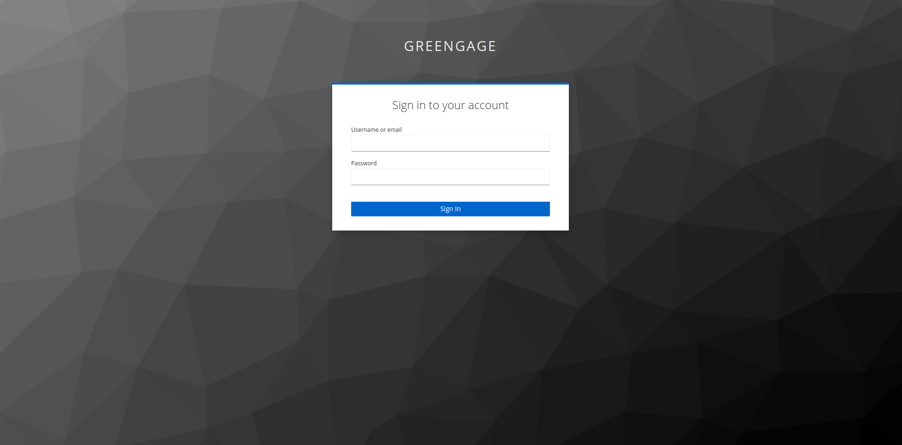

### Step 2. Setting Up a New Mapping Campaign

**Create a New Campaign**: Start by creating a new mapping campaign. This involves specifying the overarching goals and objectives of the campaign.
**Define Area of Interest (AOI)**: Use the tools available in Mission Control to define the geographic boundaries of your campaign's Area of Interest.

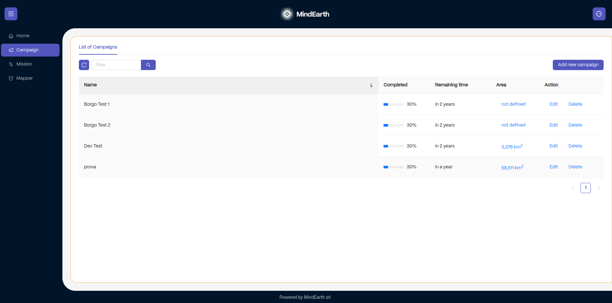
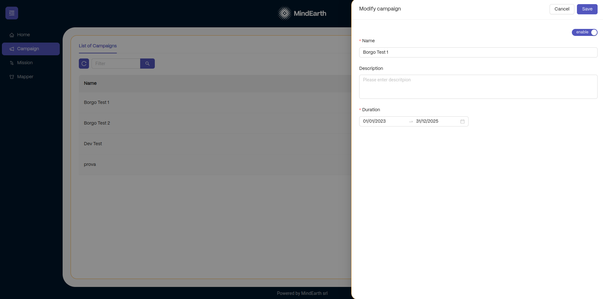

### Step 3: Designing Missions

**Creating missions**: Within a campaign, you can add individual missions. For each mission, provide specific details such as:
A title of the mission
A description of the tasks to be performed
The path to be followed by the users, defined in a GeoJson format.
Time constraints for the mission, including start and end dates and times.
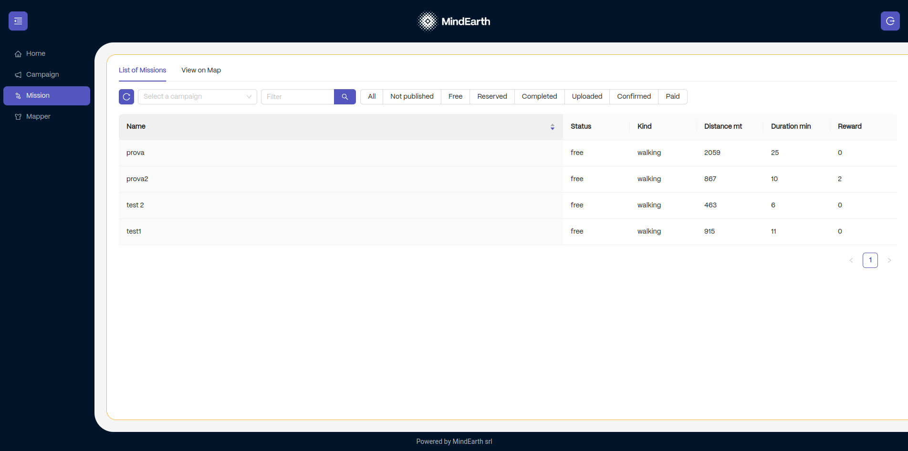
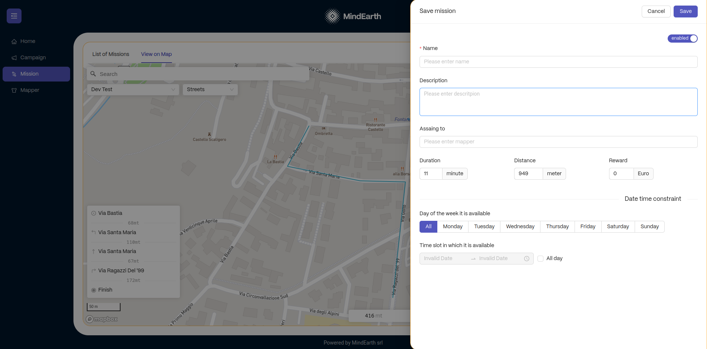

### Step 4. Setting Rewards and Effort Estimations

**Effort Estimation**: Time and distance effort associated with the mission is automatically calculated and displayed based on the provided path.
**Reward setting**: A monetary reward can be manually assigned to the mission.

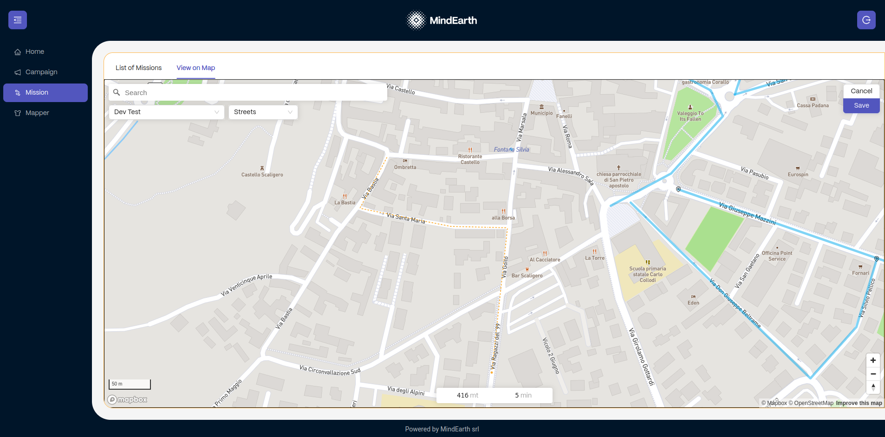

### Step 5. Publishing Missions

**Publish campaigns and missions**: Once you have finalized campaigns and missions with all necessary details, publish them to make them available to MindEarth App users.

### Step 6. Monitoring and Managing Missions

**Track Progress**: Use Mission Control’s dashboard to monitor the progress of each mission in real-time.
**Manage Data Collection**: Ensure that the data collected meets the quality standards and requirements of the campaign.

### Step 7. Confirm Mission Data

**Review and Analysis**: Review data collected from completed missions and, if quality is satisfactory to the campaign goals, confirm it to send if for AI processing.

## Dataview REST API

DataView is an integral part of the MindView system, offering a suite of interactive REST APIs that enable interaction with data collected via the MindEarth App and processed by MindEarth.

Note: DataView is still under development and no final link to the resource nor a final outline of the data endpoints is available.

### Authentication

**KeyCloak Authentication**: Secure access control for using DataView APIs.
**SSL Encryption**: All API interactions are SSL encrypted for data security during transmission.

### Get List of Campaigns

**Description**: Retrieve a list of available campaigns
**Endpoint**: https://greengage-mindview.mindearth.ai/list/campaign
**Method**: GET
**Header**: Bearer <token>
**Output Example**:
[
{
"id": 1,
"campaignName": "Test 1",
"features": [
{ "id": 6, "type": [1, 2] },
{ "id": 2, "type": [2] }
]
},
{
"id": 2,
"campaignName": "Test 2"
}
]

### Accessing Geospatial Layers

**Description**: Within the selected campaign, define the features of interest and other applicable parameters (e.g., results spatial aggregation methods).

**Endpoint**: https://greengage-mindview.mindearth.ai/results/<campaign_id>/<features_id>/<geometry_type>

- **Method**: GET
- **Header**: Bearer <token>

**Features ID** (Example of typical socio-demographic features extractable through the GREENGAGE project, as discussed with Pilot cities):

- 9 → Footfall
- 10 → Gender
- 11 → Age
- …

**Geometry Type**:
Examples of different geometry types:

- 1 → Point
- 2 → Line
- 3 → Raster Grid
- 4 → Vector Polygon

### Data Export

DataView provides options to export data in formats like JSON, CSV, etc., facilitating easy integration with external data processing tools.

## Single Sign On (SSO) Service

To facilitate a centralized user management system, MindEarth App utilizes the Keycloak system provided by Deusto as our identity and access management solution. Please refer to the relevant documentation available at this [link](https://greengage-project.github.io/Documentation/tools/keycloak/).

## Integrating MindView with the Greengage App

To streamline user interactions and mission management between different crowd-based data collection tools, a dedicated integration protocol of the MindEarth App and the GREENGAGE App is implemented. The implementation of a dedicated protocol ensures availability and visibility of MindEarth’s missions across both apps, with seamless redirection for mission execution. Please refer to the relevant documentation available at this [link](https://github.com/Greengage-project/Documentation/tree/main/docs/tools/mindview/examples/index.md).

# Testing

- You can find here some [sample output data](assets/sample_data)
- We can give you [early access to the APK](https://play.google.com/store/apps/details?id=ch.mindearth.mindviewgreengage&hl=en) and create sample missions around your location if you want to test the app and there are no active missions in your vicinity.

# Support and Contact

If you have any questions or require technical support, do not hesitate to contact our support team at [support@mindearth.ch](support@mindearth.ch).
