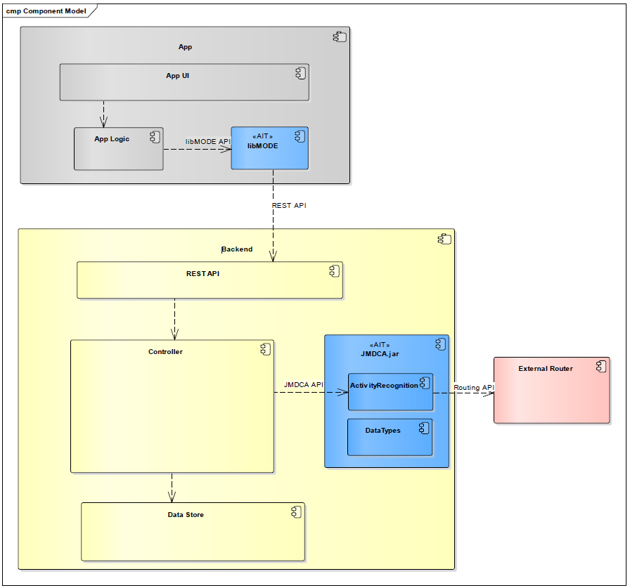

# MODE
## Setting Up a Development Environment: Guide to Integrating MODE
### Introduction

MODE software technology uses smartphones to automatically track the distances travelled and transport modes used, thus enabling software developers, system integrators and transport operators to design innovative mobility services. MODE provides the missing link for the development of innovative mobility services: automatic, reliable recognition of the means of transport used, and travelled routes using smartphones.

### Features of MODE

MODE is a trip recording and mode detection framework. It consists of two main software components:
1. A data recording module for iOS and Android Apps
2. A backend data analysis module

The above figure shows a high-level overview and demonstrates how to embed the MODE components into a system (AIT components are highlighted in blue, other components must be provided by a partner).
Client-side tracking and data recording functionality can be added to an existing App by including the `libMODE` library. 
Once the library is configured and activated
(see [Frontend](integration.md#Frontend)), it tracks user activity and records relevant movement data.
The library transmits completed trips to a backend server using REST calls (REST API, see section "REST API").

On the server side, the transmitted trip data can be processed using the AIT JMDCA library.
The JMDCA library is written in Java and provides core data structures, processing routines and analysis algorithms which allow application programmers to easily analyse trips and perform mode detection on the recorded data (JMDCA API, see section [Backend](integration.md#Backend)).
To deliver high-quality results, the JMDCA mode detection algorithm requires access to a third-party public transit routing engine (such as HERE or Google routing).

The result of using MODE are trips. These trips can include multiple segments ("legs") which make up a trip. E.g. if
a user walks to his or her car, then drives to a transit station and then takes the train to reach the destination it would yield three legs, each with:

1. Start and end times
2. The travel mode (e.g. bike, car, public transport, walking, etc.)  
3. The probability of the "correctness" (e.g. it could be "LOW; Reason: Bad GPS signal")

### Use Case Scenario

The main usage of MODE is to be integrated in smartphone apps to track user travel behavior. E.g. it was used in apps which incentivize "green" transport modes where you start the app and if it detects that you did the trip via bicycle or public transport you could earn "tokens" which could be spent on culture events.

