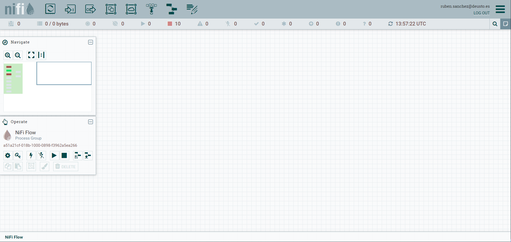
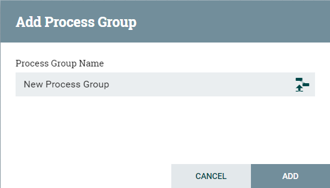
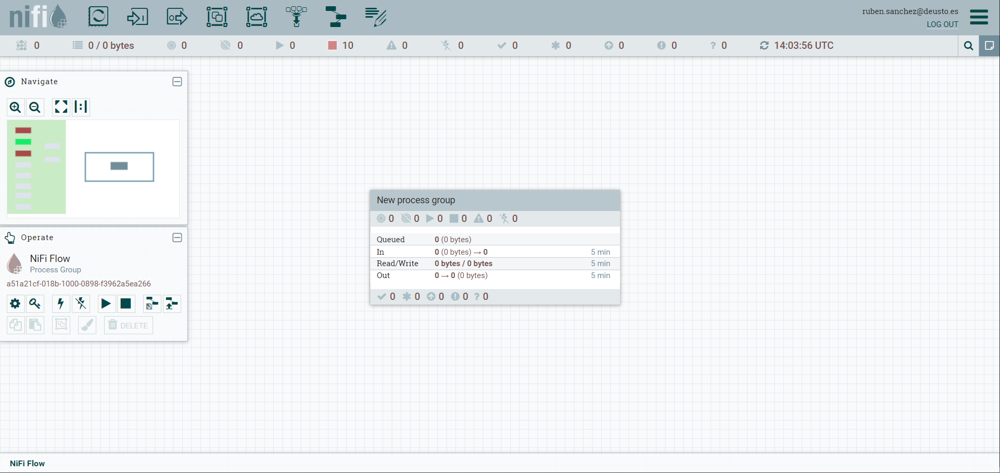
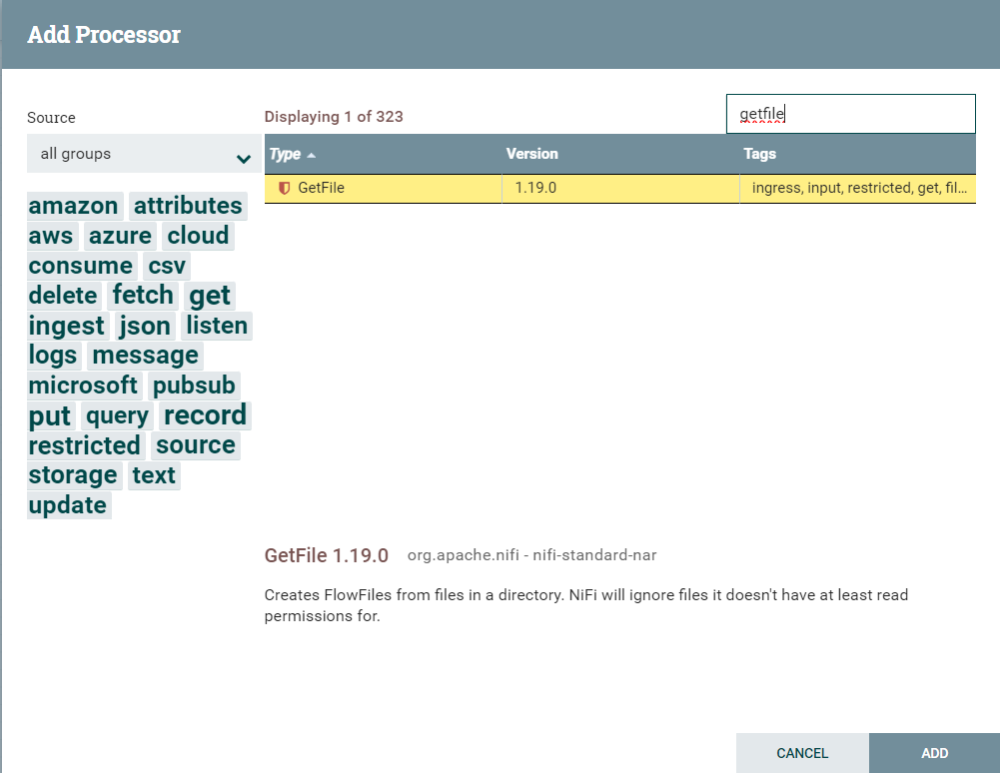
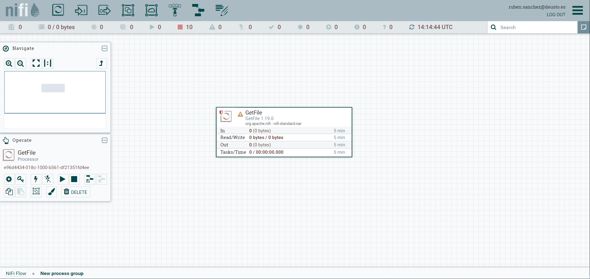
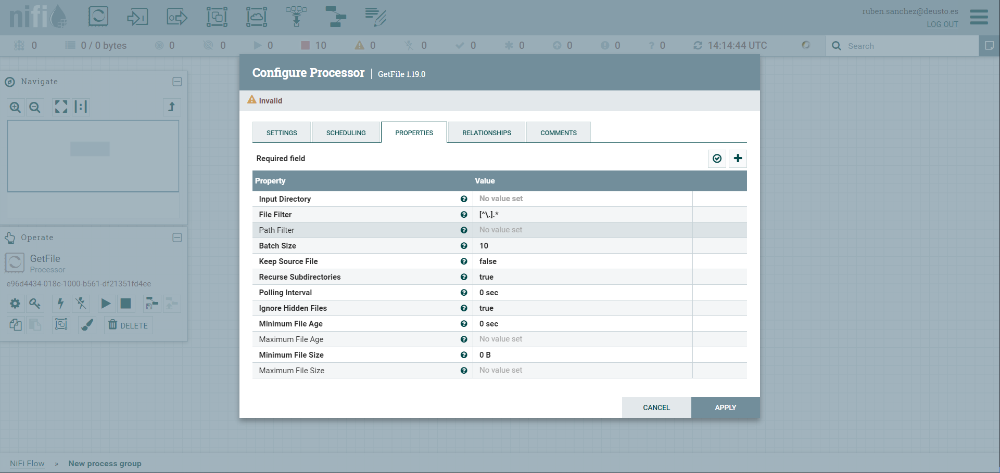
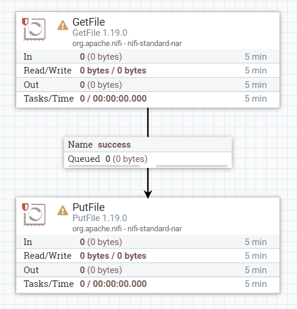
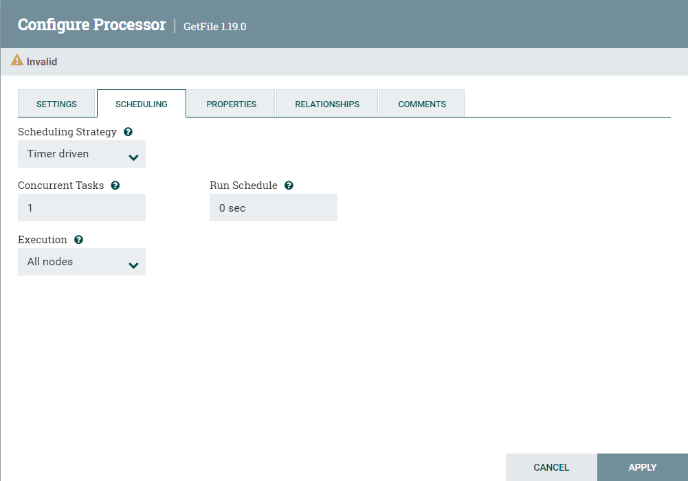
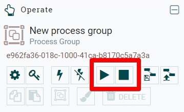
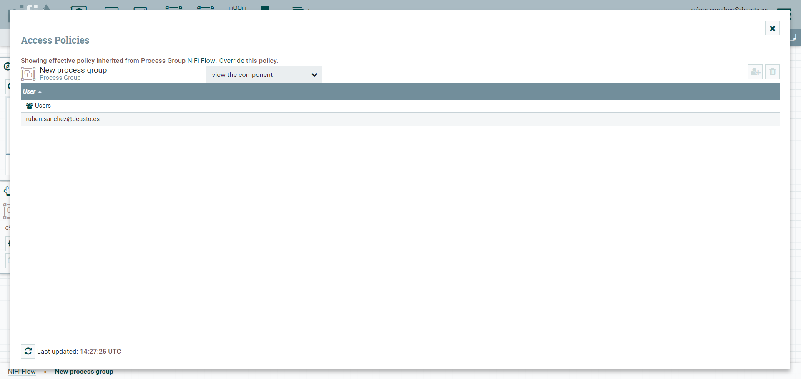

# Apache NiFi Usage Guide 

These instructions will guide you through the basic process of setting up a simple data flow.

**Step 1: Log In**
- Access to the [NiFi](https://nifi.greengage-project.eu/nifi) deploy of Greengage.
- First of all, you should login using your Greengage login in the keycloak authentication webpage that will appear.
- You will reach to the main view of the tool as shown in the figure below.

**Step 2: Creating a New Process Group:**

- Drag and drop a **Process Group** onto the canvas by selecting the fourth icon from the top menu. Process groups are containers for data flows. They allow you to group together related processors and other components. Give your process group a meaningful name, this helps in organizing different data flows.

- When you create the group it will show in the canvas like this.

- Now you can double click on it to access it and start adding new processors.

**Step 3: Adding Processors to Your Flow**

- Drag and drop processors from the components toolbar onto the canvas within your process group.

- Use processors like 'GetFile' to read data from a file system or 'ListenHTTP' for receiving data over HTTP.

- Double-click a processor to configure it. Set properties like file path for 'GetFile' or listening port for 'ListenHTTP'. Apply and save the configuration.

**Step 4: Connecting Processors**

Draw connections between processors by dragging the arrow from one processor to another. This defines the flow of data between processors.

**Step 5: Setting Up Processor Scheduling**

- Configure how often each processor runs (e.g., every 5 seconds, on an event basis). This is crucial for managing the flow and processing of data.

**Step 6: Starting and Stopping Processors**

Start individual processors or the entire process group to initiate data flow. Stop processors to make configuration changes or for maintenance.

**Step 7: Securing Your Data Flow**

If dealing with sensitive data, explore NiFi’s security options, like configuring users, groups, and policies for access control.

Remember, Apache NiFi has a steep learning curve, but its flexibility and power are unmatched for data flow management. Experiment with different processors and configurations to understand how they impact your specific use case.

