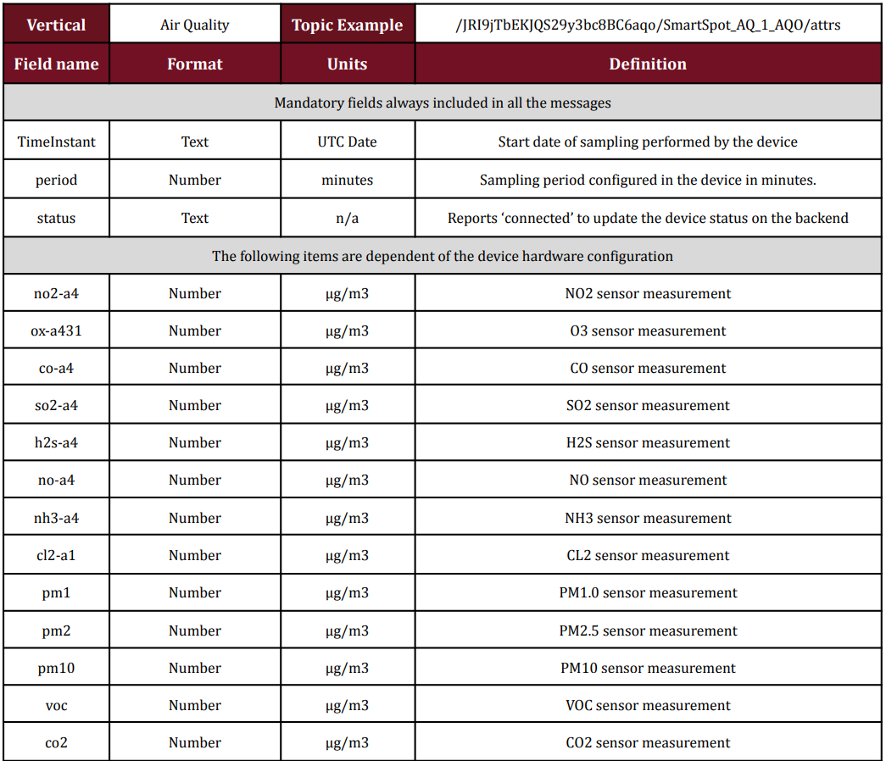

# MQTT


### Introduction

MQTT is one of the most wide IoT protocols used both due to its scalable capabilities and the
number of platforms for Smart Cities accepting this protocol. For that reason, MQTT has been
introduced in the Smart Spot to be a protocol to report values to 3rd party platforms.
Nowadays, it can be used only to report values, while managing it will be carried out using the
original Smart Spot protocol, which is LwM2M. The management can be used both from the
platform provided by Libelium so called Homard.

This version of MQTT also includes significant security and reliability improvements compared to
earlier versions. For example, authentication and authorization mechanisms were added to enable
safer and more controlled communication between devices. Session management was also
improved, and a "last will and testament" mechanism was added to ensure that devices disconnect
properly in case of a network failure.

Overall, MQTT v3.1.1 is considered a mature and stable version of the MQTT protocol and is widely
used in a variety of IoT applications, such as environmental monitoring, vehicle telemetry, asset
tracking, and more.


### Features of MQTT

1. Supported Security
MQTT v3.1.1 supports the two main security mechanisms to ensure secure communication between
devices. These include:

    * User and password-based authentication: MQTT devices can be authenticated using user and
    password credentials stored on the MQTT server.
    
    * 1.2 Digital certificates: MQTT devices can be authenticated using digital certificates, which
    provides greater security and mutual authentication between devices.
    Both of them can be configured using the remote device management platform Homard provided by
    Libelium.

2. MQTT Ports

    MQTT uses by default two different ports for communication:


    * TCP port 1883: This is the default port used for unencrypted connection. MQTT clients
    connect to the MQTT server using this port. The communication between the client and the
    server is performed without encryption, meaning that the exchanged data is not protected.
    
    * TCP port 8883: This is the port used for encrypted connection. MQTT clients can connect to
    the MQTT server using this port and establish a secure connection over TLS (Transport
    Layer Security). TLS provides an additional layer of security to MQTT communication,
    protecting the exchanged data between the client and the server

    It is important to note that default ports may vary depending on the MQTT provider or the MQTT
    server configuration. Therefore, the MQTT server documentation should be consulted to confirm      the ports used in MQTT communication and ensure that clients are properly configured to connect
    to the server. 


3. Configuration

    The vertical data concept involves grouping and organising the data reported by the device into
    different verticals depending on the transmitted data set. The grouping of this data aligns        with the definition of the official Data Models of the FIWARE platform described on the website     https://smartdatamodels.org/. Given the versatility of the Smart Spot to be configurable at the     hardware level during the order with different types of sensors, not all data verticals have to     be active on the device. The device transmits data using the necessary verticals depending on      the hardware configuration of the device. Additionally, it is possible to enable or disable        specific verticals separately through the Homard device remote platform as indicated in the        next section.


    The definition of a vertical at MQTT integration level is mainly composed of two elements:
    
      * Topic: The topic for publishing each data set of the vertical will be composed based on a
      default prefix or a topic prefix specified by the client through the Homard device remote
      platform. The topic prefix must have the following format

      <center>
        <br>
      
      ``` /{base_apikey}/{device_id} ```

        <br>
        
      </center>


    where 'base_apikey' is usually an identifying key for a set of devices and 'device_id' is a
    specific name for the device. If a topic prefix is not configured, the device will use a           default one.
    
    This topic prefix will be internally modified by the SmartSpot depending on the vertical.         Specifically, the SmartSpot will add both the ‘/attrs’ postfix corresponding to the one
    required by the FIWARE IoT Agents to receive data and the 'lower_vertical_suffix' and
    'upper_vertical_suffix' fields within the topic prefix to separate the data into different        topics, one for each vertical, resulting in the final topic being composed in the following       way:
    
    
      <center>
        <br>
      
      ``` /{base_apikey}{lower_vertical_suffix}/{device_id}_{upper_vertical_suffix}/attrs ```

        <br>
        
      </center>
      
    The following table illustrates an example of the prefix formation according to the
    publication vertical. 
    
    <center>
    <br>


    
    
    <br>
    </center>
    
    * Message: The data published through JSON-encoded text messages on each of the specified
    topics contain at least the data from the different sensors included in your Smart Spot device
    for each vertical, and may also include extra information regarding how the device is
    configured. This extra information is provided as it may be useful to the user and may enable          device configuration via MQTT protocol in the future, although this feature is not currently
    implemented. The following table illustrate the information that can be included in each
    vertical depending on your device's configuration.
    
    <center>
    <br>


    
    
    <br>
    </center>

    The example message will be:

    

      <br>

          ```{
              "TimeInstant": "2023-03-20T13:50:00Z",
              "period": 5,
              "status": "connected",
              "no2-a4": 0.640869140625,
              "ox-a431": 28.586013793945312,
              "co-a4": 91.760452270507812,
              "so2-a4": 0.927800178527832,
              "pm10": 49.334125518798828,
              "pm2": 15.33404541015625,
              "pm1": 2.1444158554077148
            } ```

      </br>


    It is important to note that if a sensor is not connected or not working properly, the field           is still included in the transmitted message, but its value is set to 'null'. The reasons for          carrying out this procedure are mainly to:
    
    * Help identify device malfunctions for maintenance tasks.
    
    * Prevent the introduction of '0' or repetitive non-real values that can cause confusion when          data persists in databases or is represented in graphs.
    
    
    
    
    
    
    
    
    
    
    
    
    
    
    
    
    
    
    
    
    
    
    
    
    
    
    
    
    
    


