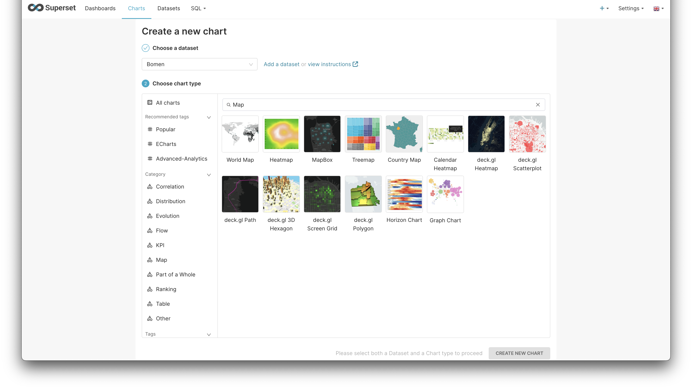
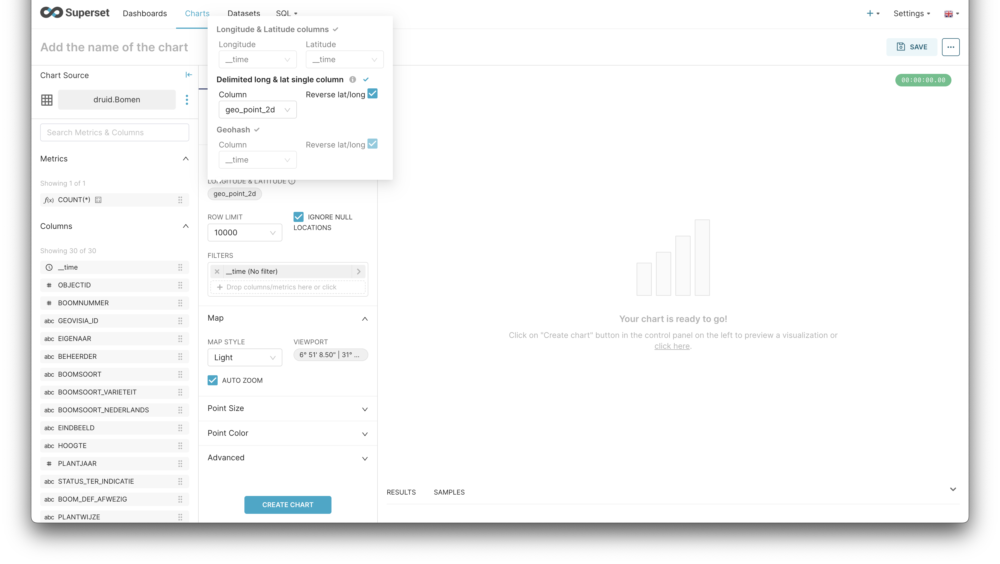
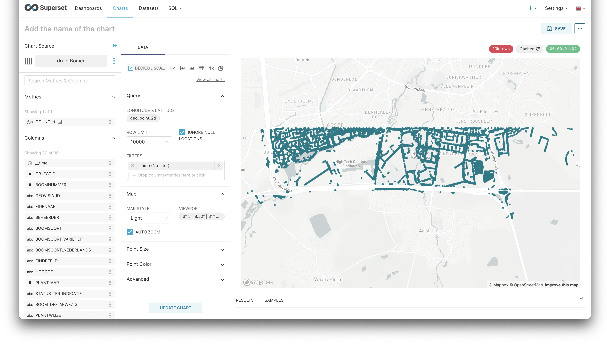

# Apache Superset

Apache Superset cannot be integrated with third-party tools, however, new data sources can be integrated into Superset.

## Integrating new data sources to Apache Superset

- Apache Superset can ingest data from more than 40 sources. 

- Some of the integrations have built-in configuration wizards, as seen in the image below. However, others, only request the connection URL as stated in [Superset documentation](https://superset.apache.org/docs/databases/installing-database-drivers#)

- Once you have added the details for the connection, Apache Superset will create a connection test and provide you with feedback on it. If the connection is successful, the new datasets are ready to be used.

## Creating a chart from geo sources

- First of all, create a chart with the desired data source. For geographical sources, the best is to put the "map" word into the search bar to find all the map-based charts.

- Once in the chart editing view, you should identify the fields regarding latitude and longitude. Note that if both fields are in one field they may be inverted.

- Once the settings are set, create or update the chart to visualise it.

