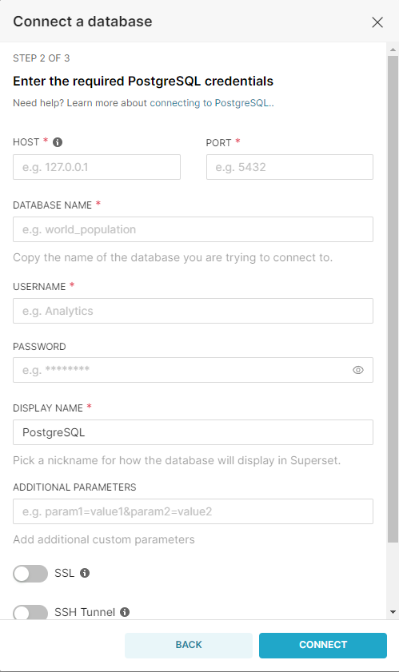

# Apache Superset

Apache Superset cannot be integrated with third party tools, however new datasources can be integrated into Superset.

## Integrating new datasources to Apache Superset

- Apache Superset can ingest data from more than 40 sources. 

- Some of the integrations have built-in configuration wizards, as seen in the image below. However, others, only request the connection URL as stated in [Superset documentation](https://superset.apache.org/docs/databases/installing-database-drivers#)

- Once you have added the details for the connection, Apache Superset will create a connection test and provide you with feedback of it. If the connection is successful, the new datasets are ready to be used.