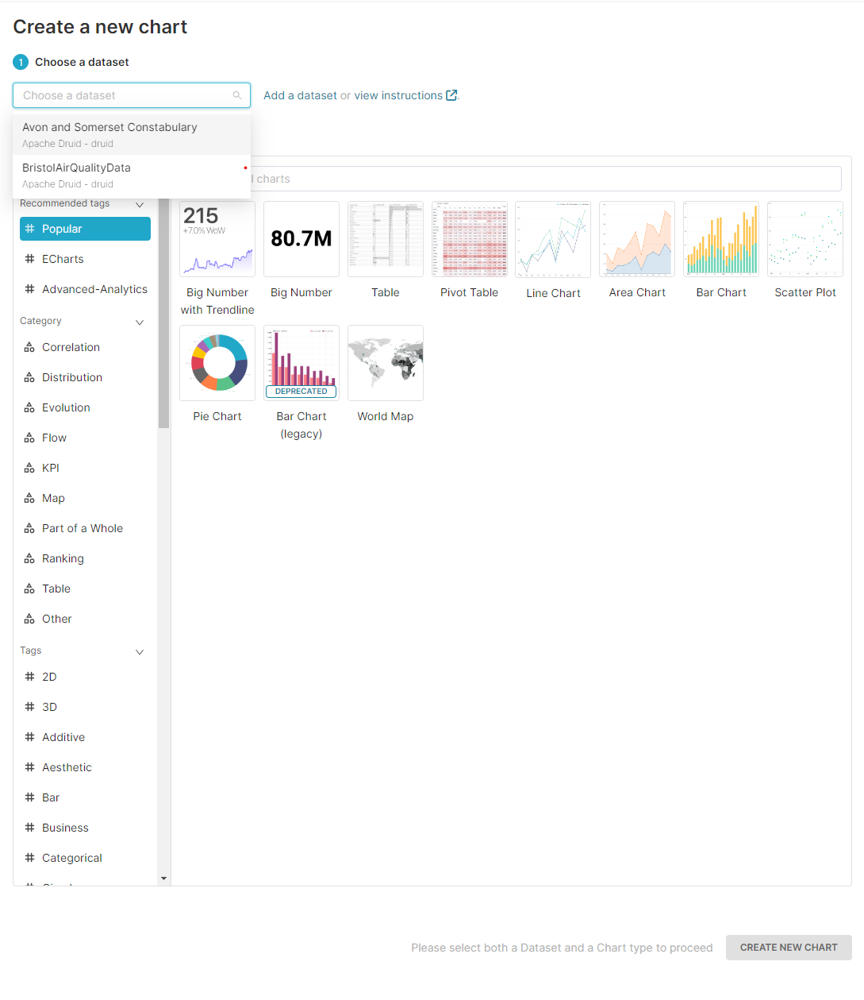

# Apache Superset Usage Guide 

**Generic usage instructions for Apache Superset**
- Instructions on how to use the tool.
  - In case there is external user manual make a small summary and refer to it.
  - Otherwise, provide enough explanations and snapshots to let a user get started with the tool usage. Include links to URLs where the tool might be deployed.
    
Introduction explaining the importance of integrating [Tool Name] to make your tool part of the GREENGAGE engine. This implies that your tool has to use the single sign on (SSO) service provided by GREENGAGE. However, you should also describe not only how your tool is integrated with GREENGAGE's SSO but also how other GREENGAGE tools may integrate with your tools. Feel free to add and rename the integrate steps listed below:

**Step 1: Log In**
- Access to the [Superset](https://superset.16.171.94.204.nip.io/) deploy of Greengage.
- First of all, you should login using your Greengage login in the keycloak authentication webpage that will appear.
- You will reach to the main view of the tool as shown in the figure below.

**Step 2: Creating datasets**

- Click on the **DATASETS** button at the top-left menu and click on the **+DATASET** button at the top-right part of the view that you have arrived.

- Introduce the database, schema and table that you want to import from the possible sources and click **CREATE DATASET AND CREATE CHART** button. 

- **NOTE:** In case that you want to connect Apache Superset to a new database or source contact with [ruben.sanchez@deusto.es](mailto:ruben.sanchez@deusto.es)

**Step 3: Creating charts**

- Click on the **CHARTS** button at the top-left menu and click on the **+CHART** button at the top-right part of the view that you have arrived.

- For the chart creation you should select a dataset and a chart type to show the data.

- Once in the chart editing view, you should add a name to the chart. In this view you have two columns: the left one has all the rows from the dataset yout selected and the right one has the settings for the chart. Once you have selected the right settings, click on the **CREATE CHART** button at the bottom of the second column. Note that to upload the chart you will have to click again in a button that updates it in the same position as the previous one.

**Step 4: Creating dashboards**

- Click on the **DASHBOARDS** button at the top-left menu and click on the **+DASHBOARD** button at the top-right part of the view that you have arrived.

- Once in the dashboard creation view, you should add a name to the dashboard. In this view you can add already created charts that appear in the right side or create new charts. Furthermore, you can add new Layout elements such as headers, text or dividers. 

**Extra: Executing SQL queries to imported datasets**

- Accessing to the SQL view using the button at the top left menu you can access a SQL statement executor against the datasets imported in Superset.

