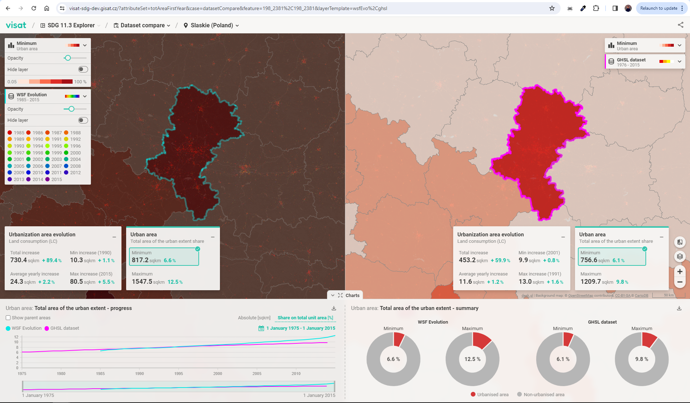

# UrbanTEP / VISAT

### Introduction

VISAT is standing for Visualization and Analytical Toolbox, is a technology provided by GISAT within the Urban Thematic and Exploration Platform (UrbanTEP). This tool is designed to facilitate the seamless integration, exploration, visualization, and analysis of diverse datasets. Moreover, VISAT is equipped with extensive collaborative features, enhancing data and result sharing among users. Developed on the robust foundation of GISAT's Panther framework, VISAT is presently undergoing substantial technological advancements. Within the GREENGAGE project, the VISAT technology, as an integral part of UrbanTEP, extends its support to Pilot solutions, ensuring capabilities such as data integration and exploration are as effective and efficient as they are in the UrbanTEP environment.

UrbanTEP/VISAT plays a pivotal role in supporting Citizen Observatory co-production processes in three main areas:
- data integration and provision,
- data visualization,
- data exploration and analysis

The extent of support required from UrbanTEP/VISAT for different Citizen Observatory projects depends on the specific needs and user requirements.

### UrbanTEP / VISAT features

VISAT visualization capabilities are powered by a robust combination of advanced libraries, chiefly Nivo charts and DeckGL, which are integrated into GISAT's Panther framework. This framework is designed to support both front-end and back-end development, providing a seamless web application experience.
Users can effectively visualize geospatial data, aiding in comprehensive urban analysis.
UrbanTEP supports the integration of large and complex datasets based on Earth Observation data. It also facilitates data provision for analysis.
The platform itself allows sharing, exporting, and ingesting derived information for use beyond the platform.

#### Charts

Nivo charts, a rich library for creating a wide array of responsive and interactive data visualizations, is built on top of D3.js, a powerful tool for manipulating documents based on data. This foundation allows Nivo charts to offer a high level of detail and customization in visual representations.
VISAT supports a diverse range of Nivo chart types, including but not limited to bar, line, pie, radar, and heatmap charts. Each chart type is designed to be highly customizable to suit different data visualization needs.
The charts are interactive, enabling users to zoom, filter, and drill down into data for more detailed insights. They are also responsive, ensuring optimal viewing across different devices and screen sizes.

#### Map components

DeckGL is a WebGL-powered framework optimized for exploring and visualizing large-scale geospatial data. Its integration into VISAT enables the rendering of large data sets in a performant and visually appealing manner.
DeckGL's layered approach allows for the creation of complex 2D visualizations, combining multiple layers of data (such as maps, scatter plots, and hexagon layers) to create rich, informative visual experiences.
DeckGL supports interactive features like tooltips, clickable objects, and viewport transitions, enhancing the user's ability to engage with and understand spatial data.

### Architecture

Visualization and Analytics Toolbox (VISAT) is based on an open extendable framework, designed as user-friendly and intuitive interface and allows data to be presented using dynamic and interlinked map and non-map component (e.g., charts, tables and graphs). The platform features two interfaces, a Web GUI, and a REST API that handles communication between multiple parts of the application, including front-end and back-end.

#### BackEnd

Backend services - set of microservices, written in JavaScript for the NodeJS environment and dockerized for easier maintenance and better scalability. At the same time, storage technologies are used according to the nature of the data + own spatial data in PostgreSQL / PostGIS. Complex metadata structures and dynamic database schemas are handled using MongoDB

#### FrontEnd

Frontend components - a set of packages written in ReactJS, using Redux for state management, D3JS for graph visualization and LeafletJS and DeckJS for map elements. 
The deployment strategy of the final product is characterized as a Cloud solution (SaaS) and can run on various platforms that support the Docker technology. The GISAT’s framework, used for VISAT creation, is based on open-source development dependencies and includes hundreds of packages that are constantly updated by third-party developers. The most common technologies and dependencies used are NodeJS, Postgres, MongoDB, and S3 storage. Overall, the Urban TEP is a reliable and efficient tool for geospatial data analysis and visualization.

### Use Case Scenario

Innovative data (based on EO) are available globally, providing detailed information on urban areas footprint evolution for a long time span. 
Data itself are huge, so user asked for following support via VISAT:

- users want to integrate these data
- users want to visualize these data
- user want to explore ana analyse data using user-defined indicators (SDG indicators)
- user want to compare indicators for different datasets, years or areas
- user want to share, export, ingest derived information for further use out of the VISAT

- [UrbanTEP VISAT SDG application example](visat-sdg.urban-tep.eu)

## References 

- [Tool specification document](https://aitonline.sharepoint.com/:w:/r/sites/HEUGREENGAGE337/_layouts/15/Doc.aspx?sourcedoc=%7B04D52F25-94E1-495E-8BB4-A31566047182%7D&file=GREENGAGE-AcademyResourceSpec_actual.docx&action=default&mobileredirect=true)
- [User manual from D4.2 page 76](https://aitonline.sharepoint.com/sites/HEUGREENGAGE337/Shared%20Documents/Forms/AllItems.aspx?csf=1&web=1&e=auwgDb&xsdata=MDV8MDF8fGUyZTU0OTEwZmYxMjQwZWMxMGY1MDhkYjEzZWM5NThjfDA3ZWYxMjA4NDEzYzRiNWU5Y2RkNjRlZjMwNTc1NGYwfDB8MHw2MzgxMjU2NzkwNDUyNTEzMTd8VW5rbm93bnxWR1ZoYlhOVFpXTjFjbWwwZVZObGNuWnBZMlY4ZXlKV0lqb2lNQzR3TGpBd01EQWlMQ0pRSWpvaVYybHVNeklpTENKQlRpSTZJazkwYUdWeUlpd2lWMVFpT2pFeGZRPT18MXxNVFkzTmprM01URXdNell3TmpzeE5qYzJPVGN4TVRBek5qQTJPekU1T20xbFpYUnBibWRmV2tSa2JWbFVTbXhhYWxGMFRWZEplbGxUTURCWmJWSnNURmRKTWs5RWEzUk9lbGt6VFcxRmQwOVVVbTFOVjBac1FIUm9jbVZoWkM1Mk1nPT18MzZlMTA3ODU4MzgwNGM0MTEwZjUwOGRiMTNlYzk1OGN8Y2I3MjI1ZGZmNDJiNDhmZDgwZjk3OWM0NWEzNDZmN2Q%3D&sdata=ZU8rdlRVTnloMUtZSlpKQUg1eCt0VWxzRm5jZ2w5TUFEYmR1VDlxODd0Zz0%3D&ovuser=f26a48e1%2Dfc21%2D461a%2Db97f%2Dac5bd535f341%2CXKHRA005%40studenti%2Eczu%2Ecz&OR=Teams%2DHL&CT=1676971115197&clickparams=eyJBcHBOYW1lIjoiVGVhbXMtRGVza3RvcCIsIkFwcFZlcnNpb24iOiIyNy8yMzAxMDEwMDkxMyIsIkhhc0ZlZGVyYXRlZFVzZXIiOnRydWV9&cid=9dc74b84%2Db106%2D4021%2D9464%2Df701cfb84316&FolderCTID=0x012000D068D8DB75D23C4BBF17727BCFAF5F22&SafelinksUrl=https%3A%2F%2Faitonline%2Esharepoint%2Ecom%2Fsites%2FHEUGREENGAGE337%2FShared%2520Documents%2FForms%2FAllItems%2Easpx&id=%2Fsites%2FHEUGREENGAGE337%2FShared%20Documents%2FGeneral%2F02%5FDeliverables%2F04%5FSubmitted%20Deliverables%2FWP4%2FGREENGAGE%5FD4%2E2%5FGREEN%5FEngine%5Fand%5Fmanual%5F2%5FFinal%2Epdf&viewid=8d5e58b2%2Da28d%2D4eae%2Dbac9%2D69afab2f27ff&parent=%2Fsites%2FHEUGREENGAGE337%2FShared%20Documents%2FGeneral%2F02%5FDeliverables%2F04%5FSubmitted%20Deliverables%2FWP4)
- [GREENGAGE catalogue entry](https://aitonline.sharepoint.com/:f:/r/sites/HEUGREENGAGE337/Shared%20Documents/WP4%20CO%20enabling%20infrastructure%20and%20interoperable/D4.1%20GREEN%20Engine%20and%20manuals/catalogue?csf=1&web=1&e=tA14VT)
