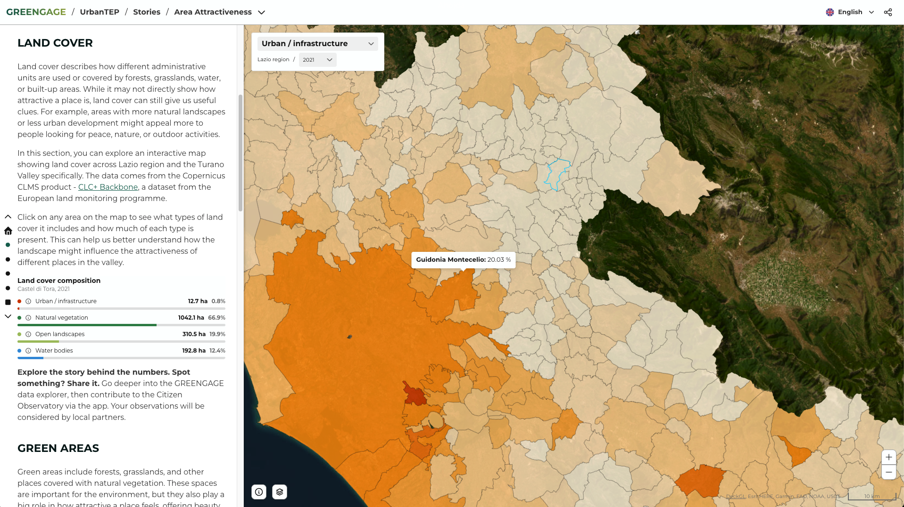
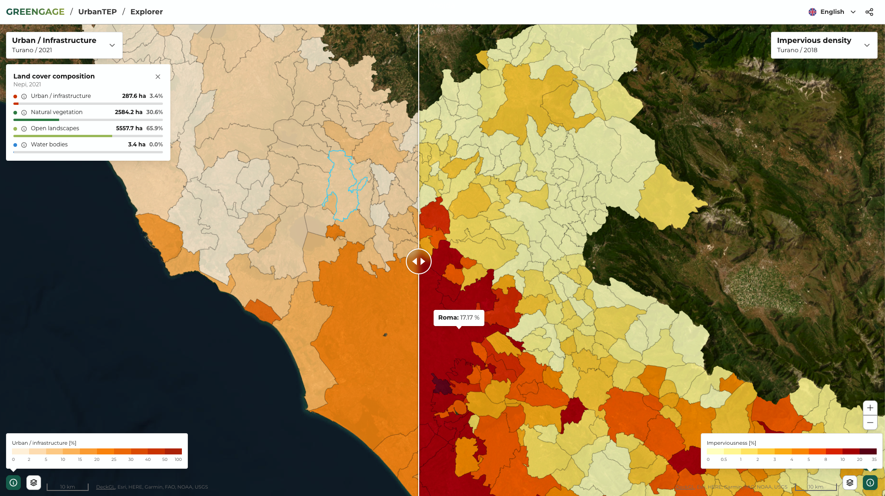

# UrbanTEP / VISAT User Guide

## Who this is for

Citizen Observatories, NGOs, and community groups can use application to explore and interpret data, generate insights, and translate evidence into clear, visual, data-driven messages that land with policymakers and public officials.

Public authorities, municipalities, and other institutions can use it to integrate multiple data sources, track indicators over time, and publish interactive dashboards and maps that support planning, reporting, and day-to-day decision-making. Urban planners and practitioners can go a level deeper, testing scenarios, evaluating interventions (e.g., mobility, green infrastructure), and grounding proposals in measurable trends.

Researchers and scientists benefit from both sides of the pipeline: they can see how datasets are interpreted and communicated in real-world settings, while also accessing the underlying data to validate findings, reproduce results, and run independent analyses using their own methods.

Data providers, project partners, and consultants can use the platform to curate and share datasets and outputs across teams, and to produce decision-support deliverables (dashboards, maps, briefings) tailored to specific stakeholders.

## Quick start

- Access the app.
- Pick a story or open the explorer.
- Toggle layers, inspect tooltips, legends, charts, and download or share outputs as needed.

## Core workflows

### Story viewer

- Narrative-led flow with side-panel text and a map canvas per chapter.
- Scroll to advance; the active chapter loads its dedicated map, layers, and legend.
- Use footer links to jump across chapters or exit to other stories/resources.

### Explorer

- Select pilot/thematic area to load relevant datasets.
- Pick a layer; the map, legend, and metadata/details panel update automatically.
- Adjust layer parameters (period, attribute, style) when available; switch opacity and visibility to compare variants.

## Map tools and interaction

- **Layer control**: toggle visibility, reorder if enabled, and adjust opacity per layer.
- **WMS Layers**: display, and manage opacity for external sources (Copernicus products).
- **Legends**: synced with active attributes; reflect breaks used in tooltips.
- **Tooltips**: hover/click to inspect feature values; highlights show the selected feature.
- **Viewport**: zoom/pan; multi-map “slider” mode can sync views for side-by-side comparisons.
- **Basemap & styles**: choose basemap where offered; switch styles for the same layer template if exposed.

## Downloading and sharing

- **Exports**: download data providers' reports. Expert users can also query the same datasets in the analytics stack via [Superset](../superset/usage.md) or [Druid](../druid/usage.md) for deeper analysis.
- **Sharing**: copy deep links to current state.

## Tips for effective use

- Prefer explorer for ad-hoc analysis; use stories to guide non-technical audiences.
- When comparing time or scenarios, keep legends aligned and use synced views to avoid misinterpretation.
- Large layers may stream tiles progressively; wait for legends/tooltips to match the loaded style before capturing outputs.
