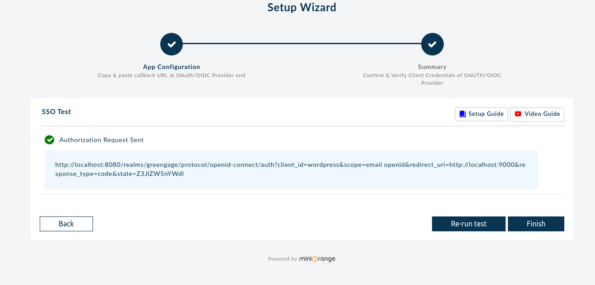
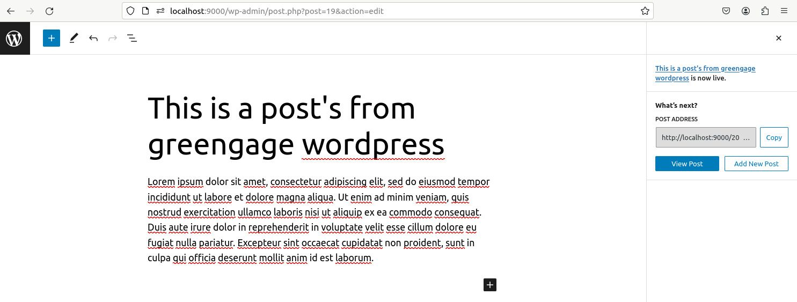
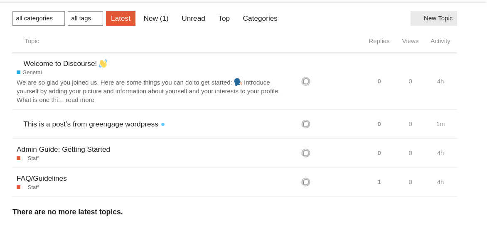
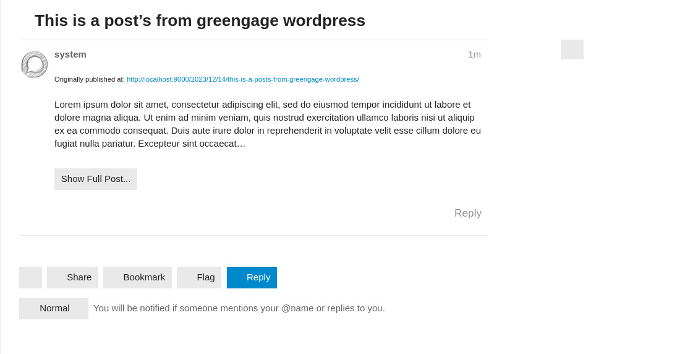
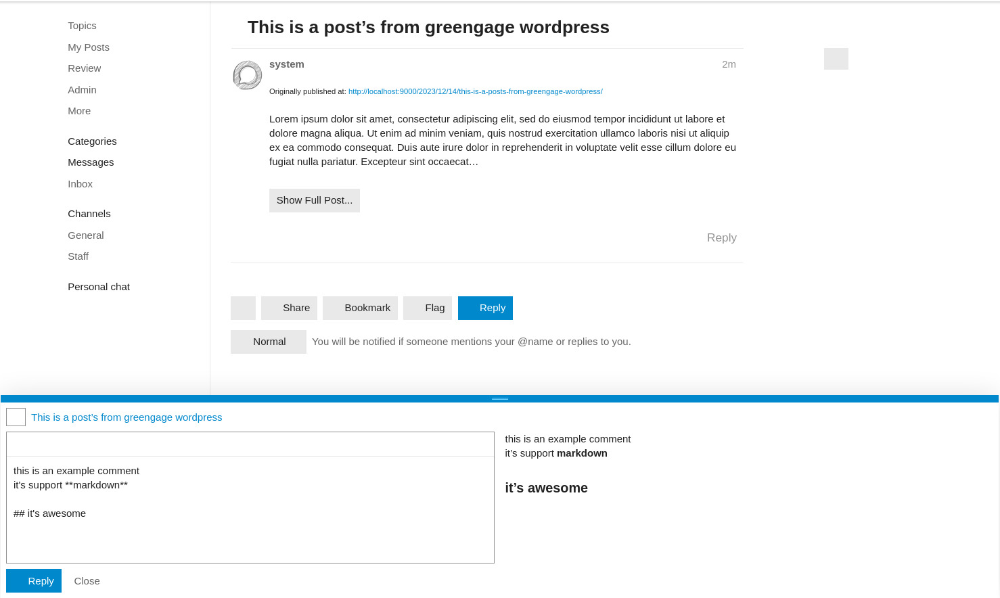

# WordPress, Keycloak, and Discourse Integration Guide

## Introduction

This guide details the process of deploying WordPress, Keycloak, and Discourse using Docker, and integrating them for a seamless user experience. This setup utilizes Keycloak for Single Sign-On (SSO) across WordPress and Discourse, enhancing security and streamlining user management.

## Prerequisites

- Docker and Docker Compose installed.
- Familiarity with Docker, YAML syntax, and basic network configurations.
- Access to a SMTP service for email functionalities.

## Docker Compose Configuration

The provided [docker-compose.yml](https://github.com/Greengage-project/Documentation/tree/main/docs/tools/wordpress/examples/docker-compose.yml) file outlines the configuration for deploying WordPress, Keycloak, and Discourse. The structure includes:

- **WordPress Service**: Utilizes the `bitnami/wordpress` image, configured for web content management.
- **MariaDB Service**: A database for WordPress.
- **Keycloak Database**: PostgreSQL database dedicated to Keycloak.
- **Keycloak Service**: Manages SSO and user authentication.
- **Discourse Services**: Includes `postgresqldiscourse`, `redis`, `discourse`, and `sidekiq` for the forum platform.

## Deploying the Services

1. **Download or Clone the Docker Compose File**: Obtain the provided [docker-compose.yml](https://github.com/Greengage-project/Documentation/tree/main/docs/tools/wordpress/examples/docker-compose.yml).

2. **Configure Environment Variables**: Replace placeholders in the file with actual values for SMTP, database credentials, and other settings.

3. **Run the Services**:

   - Execute `docker-compose up` in the directory containing the Docker Compose file.

4. **Access Services**:
   - WordPress: Accessible at `http://localhost:9000`.
   - Discourse: Accessible at `http://localhost:3000`.
   - Keycloak: Accessible at `http://localhost:8080`.

## Integrating Keycloak with WordPress and Discourse

### WordPress + Keycloak

1. **Install OAuth SSO Plugin in WordPress**:

   - Access WordPress admin panel.
   - Navigate to 'Plugins' > 'Add New'.
   - Search and install "OAuth Single Sign On – SSO (OAuth Client)".

2. **Configure Keycloak Integration**:
   - Use Keycloak's `clientid` and `secret`.
   - Follow the setup wizard in WordPress for Keycloak integration.

### Discourse + Keycloak

1. **Enable Keycloak SSO in Discourse**:

   - Access the Discourse container's command line.
   - Install the OpenID Connect plugin and configure it to use Keycloak as the SSO provider.

2. **Configure API Key in Discourse**:
   - Generate an API key in Discourse admin panel for integration purposes.

### WordPress + Discourse

1. **Install WP Discourse Plugin in WordPress**:

   - Access WordPress admin panel.
   - Navigate to 'Plugins' > 'Add New'.
   - Search and install "WP Discourse".

2. **Configure Discourse Integration**:
   - Use the Discourse API key.
   - Set up publishing and commenting settings in WordPress to synchronize with Discourse.

## Example of Post Integration from WordPress to Discourse

This example demonstrates the seamless integration of posting on WordPress and how it reflects on Discourse.

- First, we create a post in WordPress. As soon as the post is published, it automatically generates a corresponding thread in Discourse.
  
  

- Now, the post made in WordPress can be viewed as a thread in Discourse.

  

- Additionally, users can engage with the post by commenting directly in the Discourse thread.

  

## Additional Configuration and Troubleshooting

- **Email Setup**: Ensure SMTP settings are correctly configured in both WordPress and Discourse for email functionalities.
- **Security and Data Backup**: Regularly update services and back up data.
- **Troubleshooting**: Consult the official documentation of WordPress, Keycloak, and Discourse for specific issues.

## Support and Additional Resources

- **Community Forums**: Engage with community forums for WordPress, Keycloak, and Discourse for support.
- **External Documentation**: Refer to the official documentation of each tool for detailed guides and updates.

**Note**: Always ensure that you are working with the latest versions of the software and following the best practices for security and maintenance.
